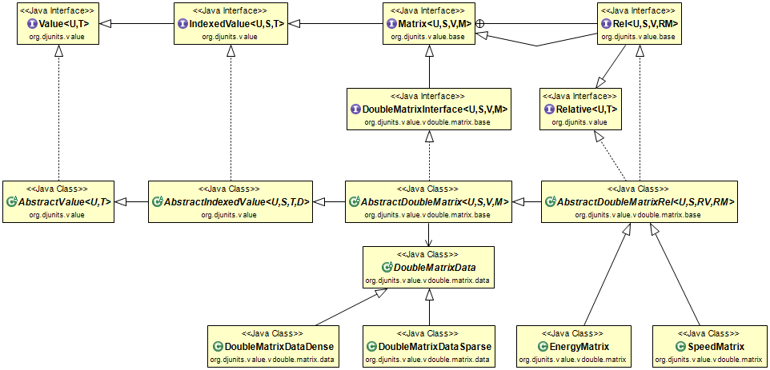
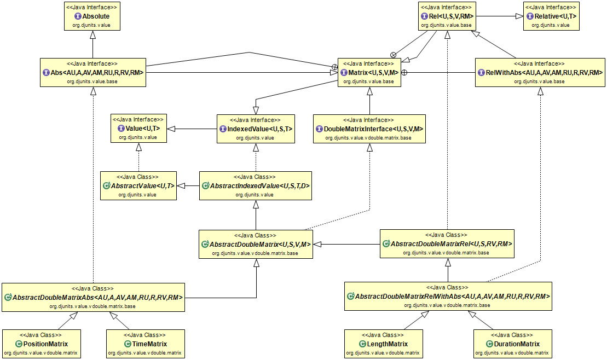

# Matrices

## Introduction

Vectors and Matrices are implemented in eight different ways: Sparse or Dense data storage, Mutable or Immutable, and Double or Float, which gives eight combinations. Sparse storage is used when the vectors or matrices contain a lot of zeroes. Dense data storage would, in that case, store all the zeroes, whereas in a sparse storage only the numbers unequal to zero are stored, together with an index. As the index provides some overhead, sparse storage makes only sense when the number of zeroes is over 50% of the number of cells. A second differentiation is Mutable versus Immutable. Normally, vectors and matrixes are immutable, just like the scalars. When, however, calculations on large matrices or vectors take place, results of those calculations always have to be stored in a new vector or matrix. When the vector or matrix is mutable, however, the result can be stored in the vector or matrix itself. Suppose that we want to round the data in a 1000x1000 matrix to the nearest integer value. With a mutable data type, this works as follows:

```java
double[][] data = new double[1000][1000];
for (int i=0; i<1000; i++) { for (int j=0; j<1000; j++) {data[i][j] = 9*i + 2*j * 0.364; }}
LengthMatrix lengthMatrix = new LengthMatrix(data, LengthUnit.CENTIMETER, StorageType.DENSE);
LengthMatrix.mutable().round();
```

Mutable vectors and matrices can be turned into immutable ones and vice versa.

Note: One of the advantages is that operations on vectors and matrices take place in parallel when the vector or matrix is sufficiently large.


## Matrix Classes, Relative implementation




## Matrix Classes, Absolute implementation


