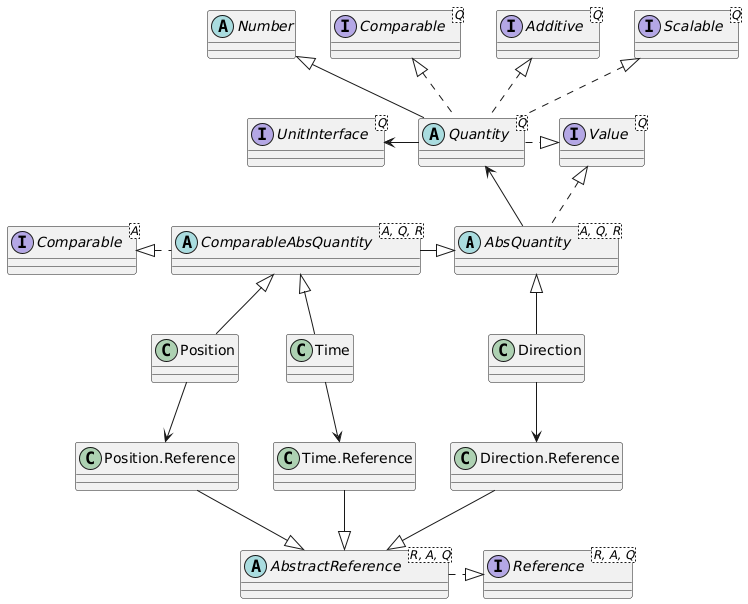

# Absolute quantities

An absolute quantity contains a value measured from a given reference point. Examples are time with a reference point 1-1-1970 (UNIX epoch) or 
a reference point 1-1-0000 (Gregorian calendar time). As an other example, a geographical direction can be defined relative to North or East 
as a reference point. Therefore, an absolute quantity is a quantity _relative to a defined reference point_. Every absolute quantity has its 
own type of reference point: a `Time` has a `Time.Reference`, a `Position` has a `Position.Reference`. Multiple instances of
reference points can be defined (such as `EAST` and `NORTH` in the `Direction` example). References can be defined relative to each other:
`NORTH` is defined as having an `Angle` difference of &pi;/2 relative to the `EAST` reference point. 

Absolute quantities therefore have three fields as compared to two fields for a relative quantity:

- the reference point of the correct type (e.g., `Direction.Reference.EAST`).
- the relative value in SI or BASE units relative to the reference point (e.g., an `Angle` of &pi;/4).
- the display unit to use (e.g., `Angle.Unit.deg`).

The above example results in a north-easterly direction, since `Angle` is defined clockwise. 

The relation between relative and absolute quantities is sketched in the class diagram below:




## Operations on absolute quantities

Adding two absolute values together makes no sense. Subtracting one absolute value from another does make sense 
(and results in a relative value). Subtracting East from North should result in an angle of ±90° or ±π/2 (depending on the unit used 
to express the result). An absolute quantity always needs a reference to be useful. Values subtracted from each other need to know 
their reference to be able to carry out the subtraction. Therefore, the reference is explicitly stored with an absolute quantity.

A relative value expresses the difference between two (absolute or relative) values. The angle in the example above is a relative 
value. Relative values can be added together and subtracted from each other (resulting in relative values). Adding a relative 
value to an absolute value results in an absolute value. Subtracting a relative value from an absolute value also results in 
an absolute value.

In the geographical example, directions are absolute and angles are relative. Similarly, when applied to lengths, positions are 
absolute and distances are relative.

Generally, if adding a value to itself makes no sense, the value is absolute; otherwise it is relative.

| Operation   | Operands              | Result      |
| ----------- | --------------------- | ----------- |
| + (plus)    | Absolute + Absolute   | Not allowed |
| + (plus)    | Absolute + Relative   | Absolute    |
| + (plus)    | Relative + Absolute   | Absolute    | 
| + (plus)    | Relative + Relative   | Relative    |
| - (minus)   | Absolute - Absolute   | Relative (corresponding quantity) |
| - (minus)   | Absolute - Relative   | Absolute    |
| - (minus)   | Relative - Absolute   | Not allowed | 
| - (minus)   | Relative - Relative   | Relative    |
| * (times)   | Absolute * Absolute   | Not allowed |
| * (times)   | Absolute * Relative   | Not allowed |
| * (times)   | Relative * Absolute   | Not allowed |
| * (times)   | Relative * Relative   | Relative (different quantity) |
| / (divide)  | Absolute / Absolute   | Not allowed |
| / (divide)  | Absolute / Relative   | Not allowed |
| / (divide)  | Relative / Absolute   | Not allowed |
| / (divide)  | Relative / Relative   | Relative (different quantity) |

Attempts to perform operations that are marked not allowed are caught at compile time.


## Available absolute quantities

All quantities make sense as relative values. The four quantities that also make sense as absolute values are listed in the 
table below.


| Quantity    | Absolute interpretation | Absolute class<br/>and Unit | Relative interpretation | Relative class<br/> and Unit |
| ----------- | ----------------------- | ----------------------------| ----------------------- | ---------------------------- |
| Length      | Position                | Position<br/>Length.Unit   | Distance                | Length<br/>Length.Unit        |
| Angle       | Direction or Slope      | Direction<br/>Angle.Unit | Angle (direction or slope difference) | Angle<br/>Angle.Unit |
| Temperature | Temperature             | Temperature<br/>Temperature.Unit | Temperature difference | TemperatureDifference<br/>Temperature.Unit |
| Time        | Time (instant)          | Time<br/>Duration.Unit           | Duration                | Duration<br/>Duration.Unit    |


## Examples

The `Temperature` absolute quantity assumes the reference `Temperature.Reference.KELVIN` as the default when it is not
mentioned in the constructor.

```java
Temperature t = new Temperature(0.0, Temperature.Unit.degF);
System.out.println("Temperature t  = " + t + ", si = " + t.si());
System.out.println("t in Kelvin    = " + t.toString(Temperature.Unit.K));
System.out.println("t in Celsius   = " + t.toString(Temperature.Unit.degC));

// add 32 degrees Fahrenheit - should be 0 Celsius
System.out.println("\nadd 32 degrees Fahrenheit - should be 0 Celsius");
TemperatureDifference t32 = new TemperatureDifference(32.0, Temperature.Unit.degF);
Temperature t2 = t.add(t32);
System.out.println("Temperature t2 = " + t2);
System.out.println("t2 in Kelvin   = "
    + t2.relativeTo(Temperature.Reference.KELVIN).toString(Temperature.Unit.K));
System.out.println("t2 in Celsius  = " 
    + t2.relativeTo(Temperature.Reference.CELSIUS).toString(Temperature.Unit.degC));
```

This prints:

```
Temperature t  = 0.00000000 °F (FAHRENHEIT), si = 0.0
t in Kelvin    = 0.00000000 K (FAHRENHEIT)
t in Celsius   = 0.00000000 °C (FAHRENHEIT)

add 32 degrees Fahrenheit - should be 0 Celsius
Temperature t2 = 32.0000000 °F (FAHRENHEIT)
t2 in Kelvin   = 491.670000 K (KELVIN)
t2 in Celsius  = 0.00000000 °C (CELSIUS)
```

Note that a Celsius temperature difference can be defined relative to 0 degrees Fahrenheit. Of course, this is typically not done;
an absolute temperature in degrees Celsius will typically be defined relative to 0 &deg;C, and similarly, kelvin and degrees Fahrenheit
will be defined relative to their 'own' natural reference point. But it is not *necessary*. 
