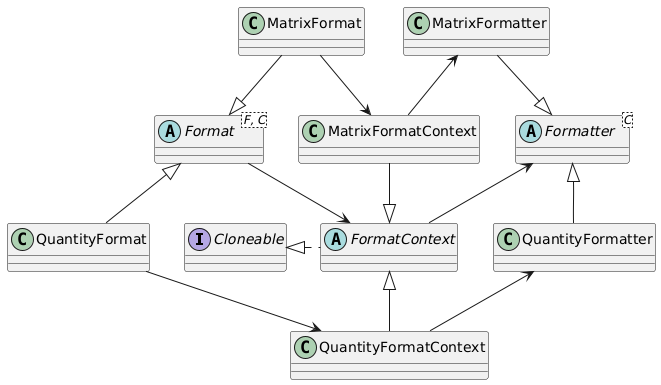

# Formatting

## Introduction

All quantities, vectors, matrices and quantity tables, both relative and absolute, can be formatted in a flexible way. All quantity-related types have a `format()` method that takes a `Format` object as a parameter. The `Format` object specifies the format that needs to be applied to the quantity-related type. Specific formatters exist for quantities, vectors, matrices and quantity tables. The format has default values that are called with the method `instance()`. Changes are applied to the settings to specify the format. As an example, let's take a length in miles, and format it in meters as a floating point variable with a thousands separator:

```java
Length l = Length.of(12.43, "mi");
Length l = Length.of(12.43, "mi");
String s = l.format(QuantityFormat.instance().setDisplayUnit("m")
    .setGroupingSeparator(true));
System.out.println(s);
```

This will print:

```
20,004.14592 m
```

All quantity-related types have four methods:

- `toString()` returns a String with a representation of the quantity-related object using the default formatting rules. 
- `format()` returns a String with a representation of the quantity-related object using the default formatting rules.
- `format(Unit unit)` returns a String, with the quantity-related object expressed in the given unit, using the default formatting rules.
- `format(Format format)` returns a String representation of the quantity-related object, using the provided formatting rules.

All `Format` subclasses implement methods for formatting the **number**, the **unit**, the **locale**, and the **reference** in case the object is absolute. The formatting rules for these four categories will be discussed below.


## Number formatting settings

The following settings for formatting the number part (entries in a vector, table or matrix, or the number of a quantity) can be used:

### Variable length formatting

The method `setVariableLength()` formats the number in a left-aligned manner without a fixed length. This format ignores the `setWidth()` and `setDecimals()` settings, but it has several settings to control the output:

- `setMaxSigDigits(int)` indicates the maximum number of significant digits. When the maximum number of significant digits is 5, numbers are formatted in such a way that at most 5 significant digits are used:

```
| Number               | Formatted      |
| -------------------- | -------------- |
| 12.3                 | [12.3 m]       |
| 12.34567             | [12.346 m]     |
| 12345.67             | [12346 m]      |
| 12345678.9           | [1.2346E+07 m] |
| 123456789123         | [1.2346E+11 m] |
```

- `setSciThreshold(int)` indicates when a fraction with an absolute value less than 1 should be formatted using scientific notation. Note that the integer parameter has to be negative. When the threshold is, e.g., -3, numbers with an absolute value **smaller** than 10^-3 are formatted using scientific notation. Numbers that are larger use floating point notation, where the number of significant digits does not count the leading zeros. Suppose `maxSigDigits = 5` and `sciThreshold = -3`:

```
| Number               | Formatted      |
| -------------------- | -------------- |
| 0.123                | [0.123 m]      |
| 0.1234567            | [0.12346 m]    |
| 0.01234567           | [0.012346 m]   |
| 0.001234567          | [0.0012346 m]  |
| 0.0001234567         | [1.2346E-04 m] | 
```

- `setGroupingSeparator(boolean)` turns the grouping separator on or off. By default, grouping is set to `false`.
- `setUpperE(boolean)` sets sets the exponent symbol to `E` if `true` and to `e` if `false`. The default value is `true`.


### Fixed-size formatting

The method `setFixedFloat()` formats the number using a fixed number of positions and a fixed number of decimals. This is an ideal format for matrices and column vectors, since the numbers (and decimal points) will be aligned. The following methods control the output:

- `setWidth(int)` sets the total width of the number, including decimals, decimal point, exponent for scientific notation, minus sign, and grouping separators. The default width is `10`.
- `setDecimals(int)` sets the number of decimals. The default number of decimals is `3`.
- `setGroupingSeparator(boolean)` turns the grouping separator on or off. By default, grouping is set to `false`.

Of course, numbers have to be in the same order of magnitude to make this format viable. Technically, if `W` is the width and `D` is the number of decimals, the Java format used is `%W.Df` without a grouping separator, and `%,D.Wf` with the grouping separator. Suppose `width = 10` and `decimals = 3`:

```
| Number               | Formatted            |
| -------------------- | -------------------- |
| 12.3                 | [    12.300 m]       |
| 12.34567             | [    12.346 m]       |
| 12345.67             | [ 12345.670 m]       |
| 12345678.9           | [12345678.900 m]     |
| 123456789123         | [123456789123.000 m] |
| 0.123                | [     0.123 m]       |
| 0.1234567            | [     0.123 m]       |
| 0.01234567           | [     0.012 m]       |
| 0.001234567          | [     0.001 m]       |
| 0.0001234567         | [     0.000 m]       |
```

> **Note** that when a small number (e.g., `0.00012345`) is formatted with, e.g. a width of 10 and 3 decimals, it will return `0.000`. See the example table above.

> **Note** that forcing large numbers into floating point format where the width is not sufficient will lead to a formatted string with a length larger than the width that was set. See the example table above.


### Scientific formatting

`setScientific()` formats the number using scientific formatting in the form of `x.yyyyE+zz` or `x.yyyyE-zz`. This is an ideal format for numbers with varying magnitudes. For matrices and column vectors, the numbers (and decimal points) will be aligned. The following methods control the output:

- `setWidth(int)` sets the total width of the number, including decimals, decimal point, exponent for scientific notation, minus sign, and grouping separators. The default width is `10`.
- `setDecimals(int)` sets the number of decimals. The default number of decimals is `3`.
- `setUpperE(boolean)` sets sets the exponent symbol to `E` if `true` and to `e` if `false`. The default value is `true`.

Technically, if `W` is the width and `D` is the number of decimals, the Java format used is `%W.DE` with `upperE` set to true, and `%W.De` with `upperE` set to false.

```
| Number               | Formatted      |
| -------------------- | -------------- |
| 12.3                 | [ 1.230E+01 m] |
| 12.34567             | [ 1.235E+01 m] |
| 12345.67             | [ 1.235E+04 m] |
| 12345678.9           | [ 1.235E+07 m] |
| 123456789123         | [ 1.235E+11 m] |
| 0.123                | [ 1.230E-01 m] |
| 0.1234567            | [ 1.235E-01 m] |
| 0.01234567           | [ 1.235E-02 m] |
| 0.001234567          | [ 1.235E-03 m] |
| 0.0001234567         | [ 1.235E-04 m] |
```

### Engineering formatting

`setEngineering()` formats the number using engineering formatting in the form of `x.yyyyE+zz` or `x.yyyyE-zz`, where the value of `zz` is always a multiple of three. You can therefore easily interpret the number in 'micro', 'milli', 'kilo', 'mega' terms. This is an ideal format for numbers with varying magnitudes that have to be interpreted using SI-prefixes. For matrices and column vectors, the numbers (and decimal points) will be aligned. The following methods control the output:

- `setWidth(int)` sets the total width of the number, including decimals, decimal point, exponent for scientific notation, minus sign, and grouping separators. The default width is `10`.
- `setDecimals(int)` sets the number of decimals. The default number of decimals is `3`.
- `setUpperE(boolean)` sets sets the exponent symbol to `E` if `true` and to `e` if `false`. The default value is `true`. 

Technically, if `W` is the width and `D` is the number of decimals, the Java format used is `%W.DE` with `upperE` set to true, and `%W.De` with `upperE` set to false.

```
| Number               | Formatted      |
| -------------------- | -------------- |
| 12.3                 | [ 12.300E+0 m] |
| 12.34567             | [ 12.346E+0 m] |
| 12345.67             | [ 12.346E+3 m] |
| 12345678.9           | [ 12.346E+6 m] |
| 123456789123         | [123.457E+9 m] |
| 0.123                | [  0.123E+0 m] |
| 0.1234567            | [  0.123E+0 m] |
| 0.01234567           | [  0.012E+0 m] |
| 0.001234567          | [  1.235E-3 m] |
| 0.0001234567         | [  0.123E-3 m] |
```


### Fixed-size formatting with scientific fallback

`setFixedWithSciFallback()` formats the number using `setFixedFloat()` if it fits the set width and will use `setScientific()` when the resulting string does not fit the set width. This will enable aligned columns for vectors or matrices, but uses precision when space allows. Widths and decimals that can store all numbers are w.d = 9.1, 10.2, 11.3 etc. For width 9 and 1 decimal, the largest number in terms of size is `-1.2E+300`. The following methods control the output:

- `setWidth(int)` sets the total width of the number, including decimals, decimal point, exponent for scientific notation, minus sign, and grouping separators. The default width is `10`.
- `setDecimals(int)` sets the number of decimals. The default number of decimals is `3`.
- `setGroupingSeparator(boolean)` turns the grouping separator on or off. By default, grouping is set to `false`.
- `setUpperE(boolean)` sets sets the exponent symbol to `E` if `true` and to `e` if `false`. The default value is `true`.

```
| Number               | Formatted      |
| -------------------- | -------------- |
| 12.3                 | [    12.300 m] |
| 12.34567             | [    12.346 m] |
| 12345.67             | [ 12345.670 m] |
| 12345678.9           | [ 1.235E+07 m] |
| 123456789123         | [ 1.235E+11 m] |
| 0.123                | [     0.123 m] |
| 0.1234567            | [     0.123 m] |
| 0.01234567           | [     0.012 m] |
| 0.001234567          | [     0.001 m] |
| 0.0001234567         | [ 1.235E-04 m] |
```


### Fixed-size formatting with engineering fallback

`setFixedWithEngFallback()` formats the number using `setFixedFloat()` if it fits the set width and will use `setEngineering()` when the resulting string does not fit the set width. This will enable aligned columns for vectors or matrices, but uses precision when space allows. Widths and decimals that can store all numbers are w.d = 9.1, 10.2, 11.3 etc. For width 9 and 1 decimal, the largest number in terms of size is `-1.2E+300`. The following methods control the output:

- `setWidth(int)` sets the total width of the number, including decimals, decimal point, exponent for scientific notation, minus sign, and grouping separators. The default width is `10`.
- `setDecimals(int)` sets the number of decimals. The default number of decimals is `3`.
- `setGroupingSeparator(boolean)` turns the grouping separator on or off. By default, grouping is set to `false`.
- `setUpperE(boolean)` sets sets the exponent symbol to `E` if `true` and to `e` if `false`. The default value is `true`.

```
| Number               | Formatted      |
| -------------------- | -------------- |
| 12.3                 | [    12.300 m] |
| 12.34567             | [    12.346 m] |
| 12345.67             | [ 12345.670 m] |
| 12345678.9           | [ 12.346E+6 m] |
| 123456789123         | [123.457E+9 m] |
| 0.123                | [     0.123 m] |
| 0.1234567            | [     0.123 m] |
| 0.01234567           | [     0.012 m] |
| 0.001234567          | [     0.001 m] |
| 0.0001234567         | [  0.123E-3 m] |
```


### Using a format string

`setFormatString(String)` allows for a user-defined format string for formatting numbers. It will ignore any settings of `setWidth()`, `setDecimals()`, `setGroupingSeparator()`, or `setUpperE()`. Suppose you want a left-aligned 12-wide, 6 significant digit format that falls back to scientific notation according to the Java format rules, you would specify: `setFormatString("%-12.6G")` (note that the .6 means 6 **significant** digits in the `%g` format, whereas it denotes the number of decimals in the `%f` format in Java). The formatting would look as follows:

```
| Number               | Formatted        |
| -------------------- | ---------------- |
| 12.3                 | [12.3000      m] |
| 12.34567             | [12.3457      m] |
| 12345.67             | [12345.7      m] |
| 12345678.9           | [1.23457E+07  m] |
| 123456789123         | [1.23457E+11  m] |
| 0.123                | [0.123000     m] |
| 0.1234567            | [0.123457     m] |
| 0.01234567           | [0.0123457    m] |
| 0.001234567          | [0.00123457   m] |
| 0.0001234567         | [0.000123457  m] |
```

### Helper method overview

Helper methods for the formatting are:

- `setWidth(width)` sets the total fixed width of the output. If the output does not fit the width, it can be overruled. The default value is `10`.
- `setDecimals(decimals)` sets the exact number of decimals for the output. The default value is `3`.
- `setMaxSigDigits(digits)` sets the maximum number of significant digits for the variable length format, to avoid trailing `.0001` or `.9999`. The default value is `6`.
- `setSciThreshold(int)` indicates when a fraction with an absolute value less than 1 should be formatted using scientific notation. The default value is `-3`.
- `setGroupingSeparator(boolean)` sets the grouping separator (e.g., thousands separator) on or off. The default value is `false`.
- `setUpperE(boolean)` sets the exponent symbol to `E` if `true` and to `e` if `false`. 

The usage of these settings by the different formats is as follows:

| Format               | Width   | Decimals | MaxSigDigits | Grouping       | UpperE               |
| -------------------- | ------- | -------- | ------------ | -------------- | -------------------- |
| VariableLength       | Ignored | Ignored  | Used         | Used           | Used                 |
| FixedFloat           | Used    | Used     | Ignored      | Used           | Ignored              |
| Scientific           | Used    | Used     | Ignored      | Ignored        | Used                 |
| Engineering          | Used    | Used     | Ignored      | Ignored        | Used                 |
| FixedWithSciFallback | Used    | Used     | Ignored      | Used for Fixed | Used for Scientific  |
| FixedWithEngFallback | Used    | Used     | Ignored      | Used for Fixed | Used for Engineering |
| FormatString         | Ignored | Ignored  | Ignored      | Ignored        | Ignored              |


## Unit formatting settings

The following settings for formatting the unit can be used:

- `setUnitPrefix(String)` defines the string that will be used just before the unit. For a quantity, it will be the string between the number and the unit. For a matrix it will be the srtring between the end of the matrix and the unit. The default value is `" "`, a single space.
- `setUnitPostfix(String)` defines the string that will be used just after the unit. An example of using this setting is when the unit has to be placed between brackets. In that case, `setUnitPrefix(" (").setUnitPostfix(")"` can be used. The default value is an empty string.
- `setDisplayUnit(Unit)` will try to format the number(s) in line with the given unit, and attach this unit to the formatted output. Note that this influences the values of the numbers as well. The display unit of the object that is being formatted remains untouched. In case the given unit is not applicable for the object being formatted, its original display unit will be used. No exception is thrown in this case. 
- `setDisplayUnit(String)` will try to parse the string into a unit, format the number(s) in line with that unit, and attach this unit to the formatted output. Note that this influences the values of the numbers as well. The display unit of the object that is being formatted remains untouched. In case the given string can not be correctly parsed, or the unit is not applicable for the object being formatted, its original display unit will be used. No exception is thrown in this case. 
- `setTextual()` uses the textual representation as defined for the unit, so `deg` for an angle in degrees. The default is the display representation.
- `setDisplay()` uses the display representation as defined for the unit, so &deg; for an angle in degrees. This is the default setting.
- `setTextual(boolean)` switches to textual or display representation, depending on the value of the boolean argument. 
- `setSiUnits()` switches the unit representation to its SI representation, so for energy, kgm<sup>2</sup>/s<sup>2</sup> instead of J. Note that the number(s) will be shown in SI units rather than in their regular display unit, so this setting influences the number display as well. The default is that the use of SI units is false. When the SI units setting is used, several other settings apply, which will be explained below.


## SI unit formatting settings

When `setSiUnits()` is applied, the number(s) will be shown relative to the SI unit, and the unit will be shown consisting of integer powers of `rad`, `sr`, `kg`, `m`, `s`, `A`, `K`, `mol`, and `cd` in the numerator and denominator. For energy, for instance, kg.m^2/s^2 can be obtained as the output string for the unit. The following formatting options are available for formatting an SI string. Note that these settings can be changed as well when SI formatting is off, and the settings will have no effect in that case.

- `setDivider(boolean)` uses a divider for the negative powers when `true` and negative powers when `false`. Energy will use `kgm2/s2` when the divider is set to `true`, and `kgm2s-2` when divider is set to false. The default value is `true` for the divider.`
- `setPowerPrefix(String)` and `setPowerPostfix(String)` provide a prefix and postfix string for all powers. As an example, suppose we want to precede powers with a caret, the we use `setPowerPrefix("^")`. The energy unit will be formatted as `kgm^2/s^2` after applying this setting. Another example is HTML formatting of the powers: `setPowerPrefix("<sup>").setPowerPostfix("</sup>")`. The energy unit will be formatted as `kgm<sup>2</sup>/s<sup>2</sup>` after applying this setting, and be displayed as <code>kgm<sup>2</sup>/s<sup>2</sup></code>. The default values for the prefix and postfix are an empty string. 
- `setDotSeparator(String)` sets a separator that will used between different SI units. Suppose that the dot separator is set to a center dot: `setDotSeparator("\u22C5")`, then the energy unit will be formated as <code>kg&sdot;m/s2</code>. The default value for the dot separator is the empty string. 

The settings can be combined to format quantities, e.g., as a HTML string:

```java
var q = Energy.of(1.23, "kJ");
var s = q.format(QuantityFormat.instance().setSiUnits().setDotSeparator("&sdot;")
    .setPowerPrefix("<sup>").setPowerPostfix("</sup>").setDivider(false));
System.out.println(s);
```

This will output: `1230 kg&sdot;m<sup>2</sup>&sdot;s<sup>-2</sup>`, which will be rendered in a browser as: <code>1230 kg&sdot;m<sup>2</sup>&sdot;s<sup>-2</sup></code>.


## Locale formatting

The locale for formatting a quantity-related object can be changed, without changing the locale for the entire program and without explicitly setting the locale in the code:

- `setLocale(Locale)` changes the locale for this format string only.

The following example shows the effect of using a locale setting:

```java
Locale.setDefault(Locale.GERMANY);
Length l = Length.of(12.43, "mi");
String sDE = l.format(QuantityFormat.instance().setDisplayUnit("m").setGroupingSeparator(true));
System.out.println(sDE);
String sUS = l.format(QuantityFormat.instance().setLocale(Locale.US)
    .setDisplayUnit("m").setGroupingSeparator(true));
System.out.println(sUS);
Locale.setDefault(Locale.US);
```

which outputs:

```
20.004,14592 m
20,004.14592 m
```


## Reference formatting (absolute)

For quantities, vectors, matrices and tables that use an absolute quantity, the reference point that is used can be formatted. Note that including the reference point is by default set to false. The following methods can be used for formatting the reference:

- `setPrintReference()` turns reference printing on.
- `setNoReference()` turns reference printing off. This is the default setting.
- `setPrintReference(boolean)` turns reference printing on or off, depending on the value of the boolean.
- `setReferencePrefix(String)` sets the prefix for the reference to the provided string. By default, the reference prefix is set to `" ("`.
- `setReferencePostfix(String)` sets the postfix for the reference to the provided string. By default, the reference postfix is set to `")"`.

As an example, suppose we want to show that the absolute temperatures are relative to 0 &deg;C, and not to 0 kelvin, by using a string `(relative to 0 &deg;C)` instead of the normal reference string, which will be ` (CELSIUS)` when turned on:

```java
Temperature t = new Temperature(0.0, Temperature.Unit.degF);
System.out.println(t.relativeTo(Temperature.Reference.CELSIUS).format(
    QuantityFormat.instance().setDisplayUnit("K").setPrintReference()
        .setReferencePrefix(" (relative to 0 ")));
```

outputs:

```
-17.77777777777777 K (relative to 0 CELSIUS)
```

## Quantity formatting

Quantity formatting is done using the `QuantityFormat` class. Since `QuantityFormat` extends `Format`, all above settings for formatting the number, unit, locale, and absolute references can be used as well. 

The `QuantityFormat` class has one additional setting, which is the formatting using SI prefixes. Using SI prefixes means that 1200 J will be displayed as 1.2 kJ, and 1.34&sdot;10<sup>-6</sup> m will be displayed as 1.34 &micro;m. 

- `setAutoSiPrefix()` turns on the scaling of SI prefixes. By default, any 10th power between -30 and +32 (inclusive) will be translated to the nearest SI unit. So, 1200 m will be turned into 1.2 km, and 1.45E-9 s will be transformed into 1.45 ns. 
- `setAutoSiPrefix(minExponent, maxExponent)` turns on the scaling of SI prefixes if the 10th power is between `minExponent` and `maxExponent`, inclusive. This can be used to prevent transformations that are not often used. For length, for instance, units above the km are not often used -- we typically do not use Mm, Gm, etc. But &micro;m, nm, pm, are often used. By calling `setAutoSiPrefix(-30, 3)`, the intended prefixes are used. 1,000,000 m will remain to be formatted in meters in this case. 
- `setAutoSiPrefix(minSiPrefixStr, maxSiPrefixStr)` turns on the scaling of SI prefixes when the exponent of the unit lies between the exponent of `minSiPrefixStr` and the exponent of `maxSiPrefixStr`, inclusive. This can be used to prevent transformations that are not often used. For length, for instance, we typically do not use Mm, Gm, etc. But &micro;m, nm, pm, are often used, whereas prefixes below picometer are rarely used as well. By calling `setAutoSiPrefix("p", "k")`, the intended prefixes are used. 1,000,000 m will remain to be formatted in meters in this case. 
- `setAllowExponents12(boolean)` indicates whether the SI prefixes `c`, `d`, `da` and `h` can also be used or not. By default this setting is `false`. A length of `0.1 m` will be formatted as `1 dm` when this setting is turned on, and when the minimum and maximum exponent allow the `d` SI prefix to be used.
- `setAllowExponents12()` turns on that the SI prefixes `c`, `d`, `da` and `h` can also be used. A weight of `1E-5 kg` will be formatted as `1 cg` when this setting is turned on, and when the minimum and maximum exponent allow the `c` SI prefix to be used.

> **Note** that the unit will automatically be translated into the SI unit to make this work. In other words, an energy in `MeV` is automatically translated into `J` if automatic SI prefixes are turned on:

```java
Energy energy = new Energy(13.34, "GeV");
System.out.println(energy.format(QuantityFormat.instance().setAutoSiPrefix()));
```

prints:

```
2.1373036297559995 nJ
```

> **Note** that the `setAutoSiPrefix()` also works for the `kg`, which already starts with a 10<sup>3</sup> power as the default unit. The scaling in `setAutoSiPrefix(minExponent, maxExponent)` is treated relative to the `g`, so if you want to print `kg`, but no `Mg`, and you do not want to go below the `pg`, use `setAutoSiPrefix(-12, 3)` or `setAutoSiPrefix("p", "k")`. The scaling also works for 'per' units, such as 'per mol', 'per kg', etc. If you want to use the `/m` for `LinearObjectDensity` between the `/nm` and `/km`, use `setAutoSiPrefix(-9, 3)` or `setAutoSiPrefix("n", "k")`. 


## Vector formatting

Vector formatting is done using the `VectorFormat.Col` class that formats a (row or column) vector as a column using one line per cell, or the `VectorFormat.Row` class that formats a (row or column) vector as a row, using one line. Since `VectorFormat` extends `Format`, all above settings for formatting the number, unit, locale, and absolute references can be used as well. 

> **Note** that the `VectorFormat.Col` and `VectorFormat.Row` class can both be used for row vectors and column vectors. This means that a row vector can be formatted as a column vector and vice versa. It's just formatting, and the vector itself is not and does not need to be transposed to format it in the other 'direction'.

For formatting vectors, the following methods are available:

- `setStartSymbol(String)` sets the start symbol of the vector itself. For all vectors, `[` is default.
- `setEndSymbol(String)` sets the end symbol of the vector itself. For all vectors, `]` is default.
- `setCellSeparator(String)` sets the separator between cells in the vector. For row formatting, `, ` is default, whereas "\n" is default for column formatting.
- `setVectorPrefix(String)` sets a prefix to use before the start symbol. It is an empty string by default, but can be used to indicate that a vector that is formatted as a row vector is actually a column vector by setting the prefix to `Col`.

The default values for vector `Row` and `Col` formatting are as follows:

| Format               | Row value       | Col value               |
| -------------------- | --------------- | ----------------------- |
| formatMode           | VARIABLE_LENGTH | FIXED_WITH_SCI_FALLBACK |
| startSymbol          | "["             | "[\n"                   |
| endSymbol            | "]"             | "]"                     |
| separatorSymbol      | ", "            | "\n"                    |
| vectorPrefix         | ""              | ""                      |


## Matrix formatting

Matrix formatting is done using the `MatrixFormat` class. Since `MatrixFormat` extends `Format`, all above settings for formatting the number, unit, locale, and absolute references can be used as well. 

By default, matrices are formatted in such a way that they can be recognized as a matrix:

```
|     11.000      14.000      17.000      20.000 |
|     23.000      30.000      37.000      44.000 |
|     35.000      46.000      57.000      68.000 |
|     47.000      62.000      77.000      92.000 | m2
```

For formatting matrices, the following methods are available:

- `setFirstRowStart(String)` sets the start symbol of the left bracket on the first row. The default is `|`.
- `setFirstRowEnd(String)` sets the end symbol of the right bracket on the first row. The default is `|\n`.
- `setMiddleRowStart(String)` sets the start symbol of the left bracket for middle rows. The default is `|`.
- `setMiddleRowEnd(String)` sets the end symbol of the right bracket for middle rows. The default is `|\n`.
- `setLastRowStart(String)` sets the start symbol of the left bracket on the last row. The default is `|`.
- `setLastRowEnd(String)` sets the end symbol of the right bracket on the last row. The default is `|`.
- `setCellSeparator(String)` sets the separator between cells in the matrix rows. It is a single space by default.
- `setMatrixPrefix(String)` sets a prefix to use before the first matrix row and before the row start symbol. It is an empty string by default.
- `setMatrixPostfix(String)` sets a postfix to use after the last matrix row and after the row end symbol, but before the unit. It is an empty string by default.


## QuantityTable formatting

Quantity table formatting is done using the `TableFormat` class. Since `TableFormat` extends `Format`, all above settings for formatting the number, unit, locale, and absolute references can be used as well. 

For formatting tables, the following methods are available:

- `setFirstRowStart(String)` sets the start symbol of the table on the first row. The default is `|`.
- `setFirstRowEnd(String)` sets the end symbol of the table on the first row. The default is `|\n`.
- `setMiddleRowStart(String)` sets the start symbol of the table for middle rows. The default is `|`.
- `setMiddleRowEnd(String)` sets the end symbol of the table for middle rows. The default is `|\n`.
- `setLastRowStart(String)` sets the start symbol of the table on the last row. The default is `|`.
- `setLastRowEnd(String)` sets the end symbol of the table on the last row. The default is `|`.
- `setCellSeparator(String)` sets the separator between cells in the table rows. It is a single space by default.
- `setTablePrefix(String)` sets a prefix to use before the first table row and before the row start symbol. It is an empty string by default.
- `setTablePostfix(String)` sets a postfix to use after the last table row and after the row end symbol, but before the unit. It is an empty string by default.


## Reusing a Format

A format can be stored and reused. When you have a format you want to reuse for multiple `format()` statements, you can store it in a variable. Suppose you want a format to print column vectors as row vectors, but start the vector with `Col` to indicate it actually a row vector. Similarly, you want to format row vectors starting with the text `Row`. Then, you can store and use the formats as follows:

```java
public static final VectorFormat.Row COLFORMAT = VectorFormat.Row.instance().setVectorPrefix("Col");
public static final VectorFormat.Row ROWFORMAT = VectorFormat.Row.instance().setVectorPrefix("Row");

public void test()
{
    var mvc = Vector3.Col.of(1, 2, 3, Mass.Unit.kg);
    var mvr = Vector3.Row.of(4, 5, 6, Mass.Unit.kg);
    System.out.println("mvc = " + mvc.format(COLFORMAT));
    System.out.println("mvr = " + mvr.format(ROWFORMAT));
}
```

which outputs:

```
mvc = Col[1, 2, 3] kg
mvr = Row[4, 5, 6] kg
```


## Changing default values

If you want to change the default values for **all** subsequent calls of one of the formatters (`QuantityFormat`, `VectorFormat.Row`, `VectorFormat.Col`, `MatrixFormat` or `TableFormat`), you can use the static method `changeDefaults()` on the `Format`, and then set the options to your liking. Suppose you want to change the format of column vectors to **always** print as row vectors, but start the vector with `C` to indicate it actually a row vector. Similarly, you **always** want to format row vectors starting with the text `R`. Then, you can set the default formats as follows:

```java
public static void main(String[] args)
{
    VectorFormat.Col.changeDefaults().setVectorPrefix("C").setCellSeparator(", ")
        .setStartSymbol("[").setVariableLength();
    VectorFormat.Row.changeDefaults().setVectorPrefix("R");
    test();
}

private static void test()
{
    var mvc = Vector3.Col.of(1, 2, 3, Mass.Unit.kg);
    var mvr = Vector3.Row.of(4, 5, 6, Mass.Unit.kg);
    System.out.println("mvc = " + mvc);
    System.out.println("mvr = " + mvr);
}
```

which outputs:

```
mvc = C[1, 2, 3] kg
mvr = R[4, 5, 6] kg
```

Note that we had to change the default column formatting with newlines to a version without newlines. Also, the value formatting that by default is fixed with scientific fallback was changed to variable length.


## Technical implementation

The format settings are stored in a `FormatContext`. `FormatContext` contains the settings for value, unit, locale and reference. The class is extended into a separate `FormatContext` classes for quantity (`QuantityFormatContext`), vector (`VectorFormatContext`), matrix (`MatrixFormatContext`), and quantity table (`TableFormatContext`). Each `FormatContext` is filled with the default values of the different settings. The diagram below shows the relationships between the `Format`, `FormatContext` and `Formatter` for quantity and matrix.



The `Format` is accessible to the user to set the preferences for formatting. These are stored in an instance of `FormatContext`. The `Formatter` uses the `FormatContext` to decide how to format the object. The abstract class `Formatter` takes care of formatting numbers, units and reference points, as well as setting the correct locale. Since, e.g., `QuantityFormatter` extends the `Formatter`, these functions are available to the `QuantityFormatter` as well. 

Below, the inner working of `QuantityFormatter` is explained. The other formatters work in a similar way. The `QuantityFormatter` has a field `DEFAULT`, which is an instance of the context, and contains the **current** default values, which can have been changed by the user:

```java
private static QuantityFormatContext DEFAULT = new QuantityFormatContext();
```

When calling `QuantityFormat.instance()`, a **clone** of this `DEFAULT` object instance is returned (that is why `FormatContext implements Cloneable`). The `set` operations for numbers, units, reference points, locale, and quantity change field values in the clone of the context object instance. This object is subsequently used by the `QuantityFormatter` object when building a string that is the result of the `format` operation. 

Each `Format` class has its own `DEFAULT` object (and `VectorFormat` has two, one for `Row` and one for `Col`). Default settings for each `Format` object can differ: where `QuantityFormat` and `VectorFormat.Row` format the value with a variable length, `VectorFormat.Col`, `MatrixFormat` and `TableFormat` have a fixed length for the value to align the values. This is done with a static initializer:

```java
private static TableFormatContext DEFAULT = makeDefault();

private static TableFormatContext makeDefault()
{
    var tfc = new TableFormatContext();
    tfc.formatMode = FloatFormatMode.FIXED_WITH_SCI_FALLBACK;
    return tfc;
}
```

As was shown above, the default settings can be changed. This is done by giving access to the `DEFAULT` object itself. Any `set` method now changes the values of the `DEFAULT` object. When this object is cloned in the next `Format.instance()` call, the changed values are used. The `FormatContext` classes themselves contains the 'default' default values, which can be reset using the method `Format.resetDefaults()`. The `resetDefaults()` method restores the original values into the `DEFAULT` object. For the `TableFormat`, this looks as follows:

```java
public static TableFormat instance()
{
    return new TableFormat(DEFAULT.clone());
}

public static TableFormat changeDefaults()
{
    return new TableFormat(DEFAULT);
}
```

> **Note** that the `VectorFormat` class has **two** inner classes, `VectorFormat.Col` and `VectorFormat.Row`. Each of these inner classes has its own `DEFAULT` object, and its own `makeDefaults()` method. This means that defaults for row vector formatting and column vector formatting can be maintained and used independent of each other.
