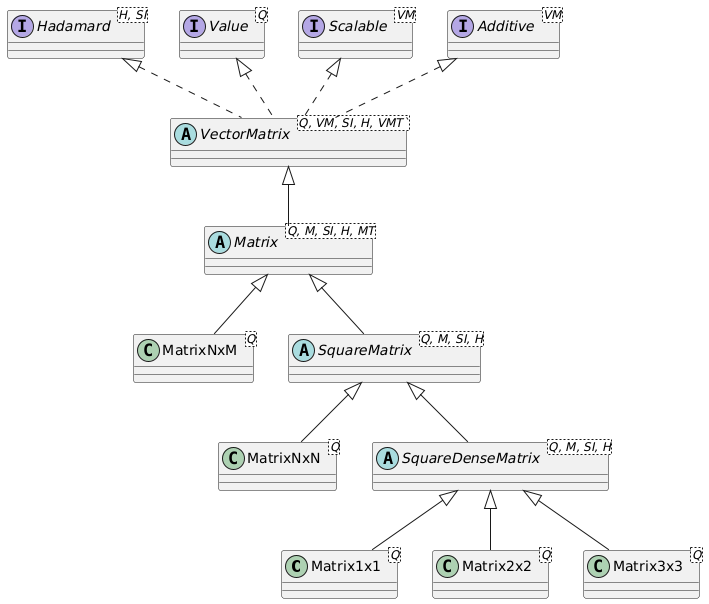

# Matrix of quantities

Vectors and Matrices are one-dimensional and two-dimensional mathematical data containers for `Quantity` values, where each instance of a `Vector` or `Matrix` contains values of one specific quantity. A `Vector` or `Matrix` has a `displayUnit` for the entire vector or matrix. Internally, vectors and matrices store all values in their SI or BASE unit, just like the `Quantity`. 

Vectors and Matrices are implemented in four different ways: Sparse or Dense data storage, combined with Double or Float precision, which gives four combinations. Sparse storage should be used for vectors or matrices that contain many zero values. Dense data storage would, in that case, store all the zeros, whereas in a sparse storage only the numbers unequal to zero are stored, together with an index. As the index adds some overhead, sparse storage only makes sense when the number of zeros is over 50% of the number of entries. 


## Matrix types

Several implementations of matrices exist, which are shown in the UML class diagram below:



As can be seen, the abstract class `Matrix` extends the abstract class `VectorMatrix`, which contains numerous methods for operations that are common to matrices, vectors and tables. Matrix multiplication is explicitly missing in the `VectorMatrix` class, since the `QuantityTable`, which extends `VectorMatrix`, does not implement matrix multiplication by design. The abstract `Matrix` class adds matrix multiplication to the `VectorMatrix` class. Square matrices as defined in the `SquareMatrix` abstract class contain additional methods that only make sense for square matrices, such as `determinant()`, `trace()`, `inverse()`, and `adjugate()`. 

The generic type of `Matrix` of any size is the `MatrixNxM`. This matrix can use sparse or dense storage, and be populated with single-precision `float` values or double precision `double` values. 

The generic type of `SquareMatrix` of any size is `MatrixNxN`. This matrix can also use sparse or dense storage, and store `float` values or `double` values. For efficiency reasons, since the `MatrixNxN` carries quite some overhead for the flexible data storage, separate classes are defined for `Matrix1x1`, `Matrix2x2`, and `Matrix3x3`. Data inside these matrices is stored in a dense `double[]` array that uses row-major indexing.


## Matrix operations

A `Matrix` implements the `Hadamard` interface for entry-by-entry operations. These include:

- `invertEntries()`: Invert the matrix on an entry-by-entry basis (1/value), where the unit will also be inverted. The inversion of a `Duration` matrix will result in a matrix of the same type (1x1, 2x2, 3x3, NxN, NxM) and size (number of rows and columns), with a unit of `1/s`, corresponding to a `Frequency` matrix. 
- `multiplyEntries(Matrix other)`: Multiply the entries of this matrix on an entry-by-entry basis with those of another matrix of the same type and size (but generally containing values of another quantity).
- `divideEntries(Matrix other)`: Divide the entries of this matrix on an entry-by-entry basis by those of another matrix of the same type and size (but generally containing values of another quantity).
- `multiplyEntries(Quantity<?, ?> quantity)`: Multiply the entries of this matrix on an entry-by-entry basis with the provided quantity.
- `divideEntries(Quantity<?, ?> quantity)`: Divide the entries of this matrix on an entry-by-entry basis by the provided quantity.

All Hadamard operations result in a new instance of the `Matrix` with a new unit, but of the same type (`Matrix2x2`, `MatrixNxM`, etc.) and with the same number of rows and columns.

The result of a Hadamard operation on, e.g. a `MatrixNxM<Speed, Speed.Unit>` will typically be a `MatrixNxM<SIQuantity, SIUnit>` since the inverse operation, multiplication or division will result in a `Matrix` with a unit that is unknown beforehand and cannot be determined by the compiler. In the above example of `invertEntries` for a `Duration` matrix, the resulting matrix can be transformed into a proper `MatrixNxM<Frequency, Frequency.Unit>` matrix using the `as(Frequency.Unit.Hz)` method.

If a `MatrixNxM` is internally of a size congruent with a specific matrix or vector type, e.g. `Vector2.Row` or `Matrix3x3`, it can be obtained as such using methods such as `asVector2Row()` or `asMatrix3x3()`. The same holds for `MatrixNxN` that can be transformed to a strongly typed `Matrix1x1`, `Matrix2x2`, or `Matrix3x3` (or `MatrixNxM`). Many such methods exist to carry out a transformation between vectors and matrices of various sizes. These methods will check the consistency of the matrix size with the desired matrix type at runtime. All matrices, irrespective of their size, can be transformed to a `QuantityTable` using the `asQuantityTable()` method.

If matrix calculations result in a special matrix type, for example multiplying a 3x4 matrix by a 4x3 matrix resulting in a 3x3 matrix, the resulting `MatrixNxM` from the calculation can be obtained as a `Matrix3x3` using the method `asMatrix3x3()`. This allows it, for example, to be added to another `Matrix3x3`. 

The `transpose()` method returns the transposed matrix, where rows and columns have been swapped. A transposed matrix has the same `displayUnit` as the original matrix.

Furthermore, a matrix is `Additive`, which means that matrices of the same type, size, and quantity can be added to and subtracted from each other. Matrices also implement the `Scalable` interface, which exposes the `scaleBy(double factor)` and `divideBy(double factor)` methods.

The generic methods of a `Matrix` are:

- `int rows()` returns the number of rows of the matrix.
- `int cols()` returns the number of columns of the matrix.
- `getDisplayUnit()` returns the display unit of the entire `Matrix`.
- `setDisplayUnit(unit)` sets a new display unit for the entire `Matrix` based on a strongly typed `unit`.
- `setDisplayUnit(string)` sets a new display unit for the entire `Matrix` based on a `String` representation of the unit.
- `boolean isRelative()` returns whether the underlying `Quantity` is relative or not. Note that `Matrix` only stores relative quantities.
- `boolean isAbsolute()` returns whether the underlying `Quantity` is absolute or not. Note that `Matrix` only stores relative quantities.
- `transpose()` returns a new `Matrix` where the rows and columns are swapped.
- `mx1.add(mx2)` returns a new `Matrix` where all entries of `mx2` have been added to the corresponding entries of `mx1`. The `displayUnit` is taken from `mx1`. The number of rows and columns of `mx1` and `mx2` have to be equal, of course.
- `mx1.subtract(mx2)` returns a new `Matrix` where all entries of `mx2` have been subtracted from the corresponding entries of `mx1`. The `displayUnit` is taken from `mx1`. The number of rows and columns of `mx1` and `mx2` have to be equal, of course.
- `mx.scaleBy(double factor)` returns a new `Matrix` where all entries of `mx` have been scaled by `factor`. The `displayUnit` remains unchanged.
- `mx.divideBy(double factor)` returns a new `Matrix` where all entries of `mx` have been scaled by `1.0/factor`. The `displayUnit` remains unchanged.

Many of the matrix operations are delegated to the mathematics utility classes `ArrayMath` and `MatrixMath`, which can be found in the `org.djunits.util` package.


## Obtaining values of matrix entries

Several methods exist to get access to the entries of a `Matrix`. When single entries, rows or columns are retrieved, two versions of the methods exist: a version where the row and column number are 0-based, and a version where the row and column number are 1-based. The 1-based methods have a name that starts with `m` for `matrix`, since the entry numbering of a matrix start with m<sub>11</sub>, and not with m<sub>00</sub>. So, there is an `si(row, col)` method where `row` ranges from `0` to `matrix.rows()-1` and `col` ranges from `0` to `matrix.cols()-1`, and an `msi(mRow, mCol)` method where `mRow` ranges from `1` up to and including `matrix.rows()` and `mCol` ranges from `1` up to and including `matrix.cols`.

Quantity-based value methods return a value `Q` that is consistent with the quantity stored in the `Matrix`. Suppose `mx` is a `Matrix3x3<Mass, Mass.Unit>`. The result of the operation `mx.mget(1,3)` will then be a strongly typed `Mass` quantity. The letter `Q` in the methods below indicates that strongly typed quantity such as `Mass`.

A `Matrix` contains the following methods to obtain its values:

### SI-based value methods

- `double[][] getSiGrid()` returns a 2-dimensional `double[][]` array with the SI-values of the entries in the matrix. 
- `double[] si()` returns the values of the matrix in SI-units as a row-major `double[]` array with the same length as the matrix. This means that for an n x m matrix (n rows, m columns), the data is stored as [a<sub>11</sub>, a<sub>12</sub>, ..., a<sub>1m</sub>, a<sub>21</sub>, a<sub>22</sub>, ..., a<sub>2m</sub>, ..., a<sub>n1</sub>, a<sub>n2</sub>, ..., a<sub>nm</sub>].
- `double si(int row, int col)` returns the SI-value of the entry at the 0-based row and column.
- `double msi(int mRow, int mCol)` returns the SI-value of the entry at the 1-based row indicated by `mRow` and 1-based column indicated by `mCol`. 


### Quantity-based value methods

- `Q[][] getScalarGrid()` returns a 2-dimensional strongly typed quantity array that represents the matrix. The quantities in the array will all have the same `displayUnit` as the original `Matrix`.
- `Q[] getScalarArray()` returns a 1-dimensional strongly typed row-major quantity array that represents the matrix. The quantities in the array will all have the same `displayUnit` as the original `Matrix`.
- `Q get(int row, int col)` returns the quantity representation of the entry at the 0-based row and column. The returned `Quantity` will have the same `displayUnit` as the original `Matrix`.
- `Q mget(int mRow, int mCol)` returns the quantity representation of the entry at the 1-based row indicated by `mRow` and 1-based column indicated by `mCol`. The returned `Quantity` will have the same `displayUnit` as the original `Matrix`.


### Retrieving matrix rows

- `Vector getRowVector(int row)` retrieves the matrix row at the 0-based `row` as a row-vector. When the matrix is a `Matrix3x3`, the vector returned is a `Vector3.Row` of the same `Quantity`, and with the same `displayUnit`. 
- `Vector mgetRowVector(int mRow)` retrieves the matrix row at the 1-based `mRow` as a row-vector. When the matrix is a `MatrixNxM`, the vector returned is a `VectorN.Row` of the same `Quantity`, and with the same `displayUnit`. 
- `Q[] getRowScalars(int row)` retrieves the matrix row at the 0-based `row` as an array of quantities. When the matrix is a `Matrix2x2<Length, Length.Unit>`, the array returned is of type `Length[2]`, where the quantities in the array have the same `displayUnit` as the original matrix. 
- `Q[] mgetRowScalars(int mRow)` retrieves the matrix row at the 1-based `mRow` as an array of quantities. When the matrix is a `MatrixNxM<Area, Area.Unit>`, the array returned is of type `Area[matrix.cols()]`, where the quantities in the array have the same `displayUnit` as the original matrix. Note that the resulting `Q[]` array is 0-based.
- `double[] getRowSi(int row)` retrieves the SI-values of the 0-based `row` as a `double[]` array. When the matrix is a `Matrix3x3`, the array returned is of type `double[3]`. 
- `double[] mgetRowSi(int mRow)` retrieves the SI-values of the 1-based `mRow` as a `double[]` array. When the matrix is a `MatrixNxM`, the array returned is of type `double[matrix.cols()]`. Note that the resulting `double[]` array is 0-based.


### Retrieving matrix columns

- `Vector getColumnVector(int col)` retrieves the matrix column at the 0-based `col` as a column-vector. When the matrix is a `Matrix3x3`, the vector returned is a `Vector3.Col` of the same `Quantity`, and with the same `displayUnit`. 
- `Vector mgetColumnVector(int mCol)` retrieves the matrix column at the 1-based `mCol` as a column-vector. When the matrix is a `MatrixNxM`, the vector returned is a `VectorN.Col` of the same `Quantity`, and with the same `displayUnit`. 
- `Q[] getColumnScalars(int col)` retrieves the matrix column at the 0-based `col` as an array of quantities. When the matrix is a `Matrix2x2<Length, Length.Unit>`, the array returned is of type `Length[2]`, where the quantities in the array have the same `displayUnit` as the original matrix. 
- `Q[] mgetColumnScalars(int mCol)` retrieves the matrix column at the 1-based `mCol` as an array of quantities. When the matrix is a `MatrixNxM<Area, Area.Unit>`, the array returned is of type `Area[matrix.cols()]`, where the quantities in the array have the same `displayUnit` as the original matrix. Note that the resulting `Q[]` array is 0-based.
- `double[] getColumnSi(int col)` retrieves the SI-values of the 0-based `col` as a `double[]` array. When the matrix is a `Matrix3x3`, the array returned is of type `double[3]`. 
- `double[] mgetColumnSi(int mCol)` retrieves the SI-values of the 1-based `mCol` as a `double[]` array. When the matrix is a `MatrixNxM`, the array returned is of type `double[matrix.cols()]`. Note that the resulting `double[]` array is 0-based.


## Mathematical operations for all matrices

A `Matrix` implements several mathematical operations. The most important ones are:

- `Q mean()` returns the mean quantity value of the entries of the `Matrix` as a strongly typed `Quantity`.
- `Q min()` returns the minimum quantity value of the entries of the `Matrix` as a strongly typed `Quantity`.
- `Q max()` returns the maximum quantity value of the entries of the `Matrix` as a strongly typed `Quantity`.
- `Q median()` returns the median quantity value of the entries of the `Matrix` as a strongly typed `Quantity`. The median value is the value  of the middle entry when all entries have been sorted on their SI-values. When the number of entries in the matrix is even, the average of the two values that together make up the middle is returned. 
- `Q sum()` returns the sum of the entries of the `Matrix` as a strongly typed `Quantity`.
- `M negate()` returns a `Matrix` of the same type and size where all entries $x_{ij}$ have been set to $-x_{ij}$. 
- `M abs()` returns a `Matrix` of the same type and size where all entries $x_{ij}$ have been set to $|x_{ij}|$. 
- `double nonZeroCount()` and `double nnz()` both return the number of non-zero entries in the matrix.


## Extra operations for square matrices

Square matrices have a number of additional operations:

- `int order()` returns the number of rows or columns of the square matrix.
- `Q trace()` returns  the trace of the matrix, which is the sum of the diagonal entries. It results in a quantity with the same `displayUnit` as the original matrix.
- `SIQuantity determinant()` returns the determinant of the square matrix as an `SIQuantity`. The unit of the determinant will be $U^n$ where $n$ is the order of the matrix, and $U$ is the SI-unit of the matrix. The `SIUnit` of the determinant of a 4x4 `Energy` matrix is kg<sup>4</sup>&middot;m<sup>8</sup>/s<sup>8</sup>.
- `double determinantSi()` returns the SI-value of the determinant of the square matrix as a `double` value.
- `inverse()` returns the inverse of the square matrix, if the matrix is non-singular. When the unit of the original matrix is $U$, the unit of of the inverse matrix is $U^{-1}$. If the matrix is singular, a `NonInvertibleMatrixException` will be thrown.
- `adjugate()` returns the adjugate (classical adjoint) matrix for this matrix, often denoted as $adj(M)$. When the unit of the original matrix is $U$, the unit of $adj(M)$ is $U^{(n-1)}$. The adjugate of a square matrix $A$ is the matrix $\mathrm{adj}(A)$ satisfying $A \cdot \mathrm{adj}(A) = \det(A) \cdot I$.
- `normFrobenius()` returns the Frobenius norm of the matrix, which is equal to $\sqrt(\mathrm{trace}(A^*\cdot A))$. It results in a quantity with the same unit as the original matrix. See [Frobenius norm on Wikipedia](https://en.wikipedia.org/wiki/Matrix_norm#Frobenius_norm) for more information.
- `Vector getDiagonalVector()` returns the quantities on the diagonal as a column vector of the same quantity and size as the square matrix. The `displayUnit` will be the same as that of the matrix.
- `Q[] getDiagonalScalars()` returns the quantities on the diagonal as an array of quantities. When the matrix has order N, the array will have length N. The `displayUnit` of the quantities will be the same as that of the matrix.
- `double[] getDiagonalSi()` returns the SI-values of the quantities on the diagonal as a `double[]` array. When the matrix has order N, the array will have length N.
- `boolean isSymmetric()` returns whether the matrix is symmetric or not. A small tolerance of of 10<sup>-12</sup> times the largest absolute SI-quantity in the matrix is used to determine symmetry.
- `boolean isSymmetric(final Q tolerance)` returns whether the matrix is symmetric or not, using a provided tolerance.
- `boolean isSkewSymmetric()` returns whether the matrix is skew-symmetric or not. A small tolerance of of 10<sup>-12</sup> times the largest absolute SI-quantity in the matrix is used to determine skew-symmetry. Skew-symmetry means that $A^T=-A$, or $a_{ij}=-a_{ji}$ for all entries $a_{ij}$.
- `boolean isSkewSymmetric(final Q tolerance)` returns whether the matrix is skew-symmetric or not, using a provided tolerance.


## Example matrix definition and usage

The example below shows the instantiation and usage of a `MatrixNxM`:

```java
MatrixNxM<Length, Length.Unit> lm2x4 = MatrixNxM.of(
  new double[][] {{1, 2, 3, 4}, {5, 6, 7, 8}}, Length.Unit.m);
MatrixNxM<Length, Length.Unit> lm4x2 = MatrixNxM.of(
  new double[][] {{1, 2}, {3, 4}, {5, 6}, {7, 8}}, Length.Unit.m);

var mult44 = lm4x2.multiply(lm2x4).as(Area.Unit.m2);
System.out.println("\nMatrix1 (4x2):\n" + lm4x2);
System.out.println("Matrix2 (2x4):\n" + lm2x4);
System.out.println("Multiplication (4x4):\n" + mult44);

Matrix2x2<Area, Area.Unit> mult22 = 
  lm2x4.multiply(lm4x2).asMatrix2x2().as(Area.Unit.a);
System.out.println("\nMatrix1 (2x4):\n" + lm2x4);
System.out.println("Matrix2 (4x2):\n" + lm4x2);
System.out.println("Multiplication (2x2):\n" + mult22);
```

The above code prints the following:

```
Matrix1 (4x2):
[1.00000000, 2.00000000
 3.00000000, 4.00000000
 5.00000000, 6.00000000
 7.00000000, 8.00000000] m
Matrix2 (2x4):
[1.00000000, 2.00000000, 3.00000000, 4.00000000
 5.00000000, 6.00000000, 7.00000000, 8.00000000] m
Multiplication (4x4):
[11.0000000, 14.0000000, 17.0000000, 20.0000000
 23.0000000, 30.0000000, 37.0000000, 44.0000000
 35.0000000, 46.0000000, 57.0000000, 68.0000000
 47.0000000, 62.0000000, 77.0000000, 92.0000000] m2

Matrix1 (2x4):
[1.00000000, 2.00000000, 3.00000000, 4.00000000
 5.00000000, 6.00000000, 7.00000000, 8.00000000] m
Matrix2 (4x2):
[1.00000000, 2.00000000
 3.00000000, 4.00000000
 5.00000000, 6.00000000
 7.00000000, 8.00000000] m
Multiplication (2x2):
[0.50000000, 0.60000000
 1.14000000, 1.40000000] a
```

As can be seen, the multiplication of a 2x4 `Length` with a 4x2 `Length` matrix results in a 2x2 `Area` matrix. The 2x2 matrix can be 'cast' to a true `Matrix2x2` class with more efficient storage and operations. When printing the content of a matrix, `Area` units such as `are` can be used.

Similarly, when multiplying in the opposite way, a 4x2 `Length` with a 2x4 `Length` matrix results in a 4x4 `Area` matrix. This matrix is of type `MatrixNxM` and could be cast to a `MatrixNxN` with the `asMatrixNxN()` method, since it is a square matrix. This cast would open the matrix for operations such as inverse, trace and determinant, which are not defined for the `MatrixNxM`. 
