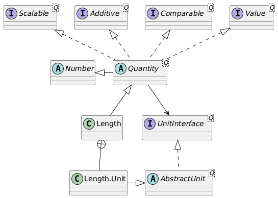

# Quantity

A (physical) quantity is a property of a material or system that can be quantified by measurement. A physical quantity can be expressed as the combination of a value (magnitude) and a unit. For example, the physical **quantity** energy can be quantified as _x_ joule where _x_ is the **value** and joule is the **unit**.<sup>1</sup>

Every quantity in DJUNITS needs a unit. One quantity can be expressed in multiple units. Typically the unit is defined as an inner class of the quantity class. As a standard the name `BASE`, or `SI` is used for the default unit and it should be public, static and final.

A Quantity is a `Number` and can therefore be used in any piece of code where a `Number` is expected:




## Constructing a quantity

The constructor of a quantity like a `Duration` is straightforward: it takes a value and a unit, a value and a String representing a unit, or another duration:

```java
Duration dur1 = new Duration(10.0, Duration.Unit.s);
Duration dur2 = new Duration(10.0, "min");
Duration dur3 = new Duration(dur2);
```

Several static `of()` and `valueOf()` methods are available as well:

```java
var dur4 = Duration.ofSi(10.0); // results in a duration of 10 seconds
var dur5 = Duration.valueOf("20 min"); // results in a duration of 20 minutes
var dur6 = Duration.of(24.0, "h"); // results in a duration of 24 hours
```


## Requesting information of the quantity

Quantities are strongly typed, and many operations on quantities are possible. A couple of examples are:

- `getDisplayUnit()` to ask the current unit in which the quantity is displayed.
- `setDisplayUnit(newUnit)` to give the unit a new display unit, without changing its value. Values are _always_ stored using the SI or BASE unit.
- `si()` to give the value of the quantity expressed in SI or BASE units.
- `getInUnit(targetUnit)` to get the value expressed in the given target unit.
- `doubleValue()`, `floatValue()`, `intValue()`, etc. are provided since `Quantity` extends `Number`.
- logical operators such as `lt`, `le`, `eq`, `ne`, to check whether one quantity is, e.g., bigger or smaller than another one.
- logical operators such as `lt0`, `le0`, `eq0`, `ne0` to check whether one quantity is, e.g., bigger or smaller than zero.
- `toString()` with several variants for formatting the unit, so it can be expressed, e.g., as `kgm/s2` or `kg.m.s-2` or as a HTML string `kg.m.s<sup>-2</sup>`.
- finally, methods are available to ask information about the quantity, such as its `SIUnit` through the method `siUnit()`, and the (localized) name of the quantity with `getName()`


## Operations on the quantity

(Relative) quantities can always be added to and subtracted from other relative quantities of the same type, independent of the unit. Relative quantities can also be scaled, negated, and the reciprocal of a quantity can be calculated. Some examples:

```java
Duration dur = Duration.of(0.5, "s");
Frequency freq = dur.reciprocal(); // 2 Hz
var dur4 = dur.scaleBy(4.0); // 2 s
var dur5 = dur4.negate(); // -2 s
var dur6 = Duration.of(2.0, "min").add(dur.scaleBy(60.0)); // 2.5 min
```

Quantities can also be multiplied with and divided by quantities of other types. The correct SI-dimension for the resulting quantity is calculated, and for known multiplications and divisions, a quantity of the correct type is returned:

```java
Length length = Length.of(80.0, "km");
Duration hour = Duration.of(1.0, "h");
Speed speed = length.divide(hour);
```

The value of `speed` above will be 80 km/h. It will also be strongly typed as a `Speed` quantity. Because the calculation takes place in SI units, the resulting speed value will be expressed in the SI default unit for speed: m/s. If we want it expressed as km/h, we use:

```java
Speed speed = length.divide(hour).setDisplayUnit(Speed.Unit.km/h);
```

In case the multiplication or division results in a quantity that is not known, an `SIQuantity` with a unit `SIUnit` will be returned. See the following example:

```java
Duration s = Duration.of(20.0, "s");
var s2 = s.multiply(s);
```

Here, `s2` will have an internal si-value of `400`, and a unit of `s^2`. The type will be `SIQuantity`. Suppose, we divide a length by this variable to obtain an acceleration. In that case the compiler does not know that the result will be an `Acceleration` quantity type. We can transform the result to an `Acceleration` with the `as` method. This method will give an error if the units do not compute:

```
var l = Length.of(10.0, "m");
var a1 = l.divide(s2); // SIQuantity
System.out.println("a1 = " + a1);
System.out.println("a1.class = " + a1.getClass().getSimpleName());
var a2 = a1.as(Acceleration.Unit.m_s2);
System.out.println("a2 = " + a2);
System.out.println("a2.class = " + a2.getClass().getSimpleName());
var a3 = s2.as(Acceleration.Unit.m_s2);
```

This results in:

```
a1 = 0.02500000 m/s2
a1.class = SIQuantity
a2 = 0.02500000 m/s2
a2.class = Acceleration
Exception in thread "main" java.lang.IllegalArgumentException: 
  Quantity.as (804): Quantity.as(m/s2) called, but units do not match: s2 <> m/s2
```


<hr>
<sup>1</sup>. See [https://en.wikipedia.org/wiki/Physical_quantity](https://en.wikipedia.org/wiki/Physical_quantity)
