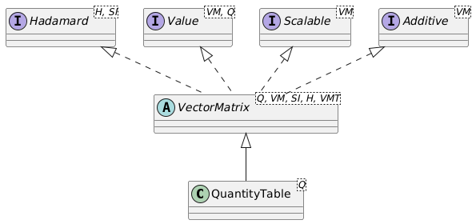

# Quantity Table

## Introduction

Quantity tables are 2-dimensional tables with quantity data of the same type. They can be regarded as generic data containers, suitable for data interfaces or method input types. In a sense, it acts like a `MatrixNxM` without the ability to carry out matrix and vector calculations. Hadamard (entry-by-entry) operations on quantity tables are supported.

The `QuantityTable` supports dense storage in a `double[]` or `float[]` array, or sparse storage, where values are stored with an integer-based row-column index and a `double` or `float` value. Since the sparse storage involves quite some overhead, tables need to have a significant percentage of 0-values (40-50% or more) for using sparse storage to make sense. 

## Quantity table operations

A `QuantityTable` implements the `Hadamard` interface for entry-by-entry operations. These include:

- `invertEntries()`: Invert each entry of the table (1/value), where the unit will also be inverted. The inversion of a the entries of a `Duration` quantity table will result in a quantity table of the same size (number of rows and columns), with a unit of `1/s`, corresponding to a `Frequency`. 
- `multiplyEntries(QuantityTable other)`: Multiply all entries of this quantity table with those of another quantity table of the same size (but generally containing values of another quantity).
- `divideEntries(QuantityTable other)`: Divide all entries of this quantity table by those of another quantity table of the same size (but generally containing values of another quantity).
- `multiplyEntries(Quantity<?, ?> quantity)`: Multiply all entries of this quantity table with the provided quantity.
- `divideEntries(Quantity<?, ?> quantity)`: Divide all entries of this quantity table by the provided quantity.

All Hadamard operations result in a new instance of a `QuantityTable` with a new unit, but with the same number of rows and columns.

The result of a Hadamard operation on, e.g. a `QuantityTable<Duration>` will typically be a `QuantityTable<SIQuantity>` since the inverse operation, multiplication or division will result in a `QuantityTable` with a unit that is unknown beforehand and cannot be determined by the compiler. In the above example of `invertEntries` for a `Duration` quantity table, the resulting quantity table can be transformed into a proper `QuantityTable<Frequency>` using the `as(Frequency.Unit.Hz)` method. Note that the resulting `QuantityTable<Frequency>` is a new instance of the table, and the original `QuantityTable` remains unchanged.

The `transpose()` method returns the transposed quantity table, where rows and columns have been swapped. A transposed quantity table has the same `displayUnit` as the original matrix.

Furthermore, a quantity table is additive, which means that two tables of the same size and same quantity can be added to and subtracted from each other. Quantity tables also implement the `Scalable` interface, which exposes the `scaleBy(double factor)` and `divideBy(double factor)` methods, scaling the entries of the quantity table by `factor`, respectively `1.0 / factor`.

The generic methods of a `QuantityTable` are:

- `int rows()` returns the number of rows of the quantity table.
- `int cols()` returns the number of columns of the quantity table.
- `getDisplayUnit()` returns the display unit of the entire `QuantityTable`.
- `setDisplayUnit(unit)` sets a new display unit for the entire `QuantityTable` based on a strongly typed `unit`.
- `setDisplayUnit(string)` sets a new display unit for the entire `QuantityTable` based on a `String` representation of the unit.
- `boolean isRelative()` returns whether the underlying `Quantity` is relative or not. Note that `QuantityTable` only stores relative quantities.
- `boolean isAbsolute()` returns whether the underlying `Quantity` is absolute or not. Note that `QuantityTable` only stores relative quantities.
- `transpose()` returns a new `QuantityTable` where the rows and columns are swapped.
- `qt1.add(qt2)` returns a new `QuantityTable` where all entries of `qt2` have been added to the corresponding entries of `qt1`. The `displayUnit` is taken from `qt1`. The number of rows and columns of `qt1` and `qt2` have to be equal, of course.
- `qt1.subtract(qt2)` returns a new `QuantityTable` where all entries of `qt2` have been subtracted from the corresponding entries of `qt1`. The `displayUnit` is taken from `qt1`. The number of rows and columns of `qt1` and `qt2` have to be equal, of course.
- `qt.scaleBy(double factor)` returns a new `QuantityTable` where all entries of `qt` have been scaled by `factor`. The `displayUnit` remains unchanged.
- `qt.divideBy(double factor)` returns a new `QuantityTable` where all entries of `qt` have been scaled by `1.0/factor`. The `displayUnit` remains unchanged.

## Obtaining values of quantity table entries

Several methods exist to get access to the entries of a `QuantityTable`. When single entries, rows or columns are retrieved, two versions of the methods exist: a version where the row and column number are 0-based, and a version where the row and column number are 1-based. The 1-based methods have a name that starts with `m` for `matrix`, since the entry numbering of a matrix start with m11, and not with m00. So, there is an `si(row, col)` method where `row` ranges from `0` to `table.rows()-1` and `col` ranges from `0` to `table.cols()-1`, and an `msi(mRow, mCol)` method where `mRow` ranges from `1` up to and including `table.rows()` and `mCol` ranges from `1` up to and including `table.cols`.

Quantity-based value methods return a value `Q` that is consistent with the quantity stored in the `QuantityTable`. Suppose `qt` is a `QuantityTable<Mass>`. The result of the operation `qt.get(1,3)` will then be a strongly typed `Mass` quantity. The letter `Q` in the methods below indicates that strongly typed quantity such as `Mass`.

A `QuantityTable` contains the following methods to obtain its values:

### SI-based value methods

- `double[][] getSiGrid()` returns a 2-dimensional `double[][]` array with the SI-values of the entries in the quantity table. 
- `double[] si()` returns the values of the quantity table in SI-units as a row-major `double[]` array with the same length as the quantity table. This means that for a quantity table with n rows and m columns, the data is stored as [a11, a12, ..., a1m, a21, a22, ..., a2m, ..., an1, an2, ..., anm].
- `double si(int row, int col)` returns the SI-value of the entry at the 0-based row and column.
- `double msi(int mRow, int mCol)` returns the SI-value of the entry at the 1-based row indicated by `mRow` and 1-based column indicated by `mCol`. 

### Quantity-based value methods

- `Q[][] getScalarGrid()` returns a 2-dimensional strongly typed quantity array that represents the quantity table. The quantities in the array will all have the same `displayUnit` as the original `QuantityTable`.
- `Q[] getScalarArray()` returns a 1-dimensional strongly typed row-major quantity array that represents the quantity table. The quantities in the array will all have the same `displayUnit` as the original `QuantityTable`.
- `Q get(int row, int col)` returns the quantity representation of the entry at the 0-based row and column. The returned `Quantity` will have the same `displayUnit` as the original `QuantityTable`.
- `Q mget(int mRow, int mCol)` returns the quantity representation of the entry at the 1-based row indicated by `mRow` and 1-based column indicated by `mCol`. The returned `Quantity` will have the same `displayUnit` as the original `QuantityTable`.

### Retrieving quantity table rows

- `VectorN.Row getRowVector(int row)` retrieves the quantity table row at the 0-based `row` as a row-vector with the same `displayUnit`. 
- `VectorN.Row mgetRowVector(int mRow)` retrieves the quantity table row at the 1-based `mRow` as a row-vector with the same `displayUnit`. 
- `Q[] getRowScalars(int row)` retrieves the quantity table row at the 0-based `row` as an array of quantities, where the quantities in the array have the same `displayUnit` as the original quantity table. 
- `Q[] mgetRowScalars(int mRow)` retrieves the quantity table row at the 1-based `mRow` as an array of quantities, where the quantities in the array have the same `displayUnit` as the original matrix. Note that the resulting `Q[]` array is 0-based.
- `double[] getRowSi(int row)` retrieves the quantity table row at the 0-based `row` as a `double[]` array with SI-values. 
- `double[] mgetRowSi(int mRow)` retrieves the quantity table row at the 1-based `mRow` as a `double[]` array with SI-values. Note that the resulting `double[]` array is 0-based.

### Retrieving quantity table columns

- `VectorN.Col getColumnVector(int col)` retrieves the quantity table column at the 0-based `col` as a column-vector with the same `displayUnit`. 
- `VectorN.Col mgetColumnVector(int mCol)` retrieves the quantity table column at the 1-based `mCol` as a column-vector with the same `displayUnit`. 
- `Q[] getColumnScalars(int col)` retrieves the quantity table column at the 0-based `col` as an array of quantities, where the quantities in the array have the same `displayUnit` as the original quantity table. 
- `Q[] mgetColumnScalars(int mCol)` retrieves the quantity table column at the 1-based `mCol` as an array of quantities, where the quantities in the array have the same `displayUnit` as the original quantity table. Note that the resulting `Q[]` array is 0-based.
- `double[] getColumnSi(int col)` retrieves the quantity table column at the 0-based `col` as a `double[]` array with SI-values. 
- `double[] mgetColumnSi(int mCol)` retrieves the quantity table column at the 1-based `mCol` as a `double[]` array with SI-values. Note that the resulting `double[]` array is 0-based.

## Mathematical operations for `QuantityTable`

A `QuantityTable` implements several mathematical operations. The most important ones are:

- `Q mean()` returns the mean quantity value of the entries of the `QuantityTable` as a strongly typed `Quantity`.
- `Q min()` returns the minimum quantity value of the entries of the `QuantityTable` as a strongly typed `Quantity`.
- `Q max()` returns the maximum quantity value of the entries of the `QuantityTable` as a strongly typed `Quantity`.
- `Q median()` returns the median quantity value of the entries of the `QuantityTable` as a strongly typed `Quantity`. The median value is the value  of the middle entry when all entries have been sorted on their SI-values. When the number of entries in the quantity table is even, the average of the two values that together make up the middle is returned. 
- `Q sum()` returns the sum of the entries of the `QuantityTable` as a strongly typed `Quantity`.
- `M negate()` returns a `QuantityTable` of the same type and size where all entries $x_{ij}$ have been set to $-x_{ij}$. 
- `M abs()` returns a `QuantityTable` of the same type and size where all entries $x_{ij}$ have been set to $|x_{ij}|$. 
- `double nonZeroCount()` and `double nnz()` both return the number of non-zero entries in the quantity table.

## Transforming the `QuantityTable`

`QuantityTable` objects do not implement matrix operations such as determinant, matrix multiplication, etc. If a `QuantityTable` at some point needs to be used for matrix operations, the `asVector` and `asMatrix` methods can transform the `QuantityTable` into a `Matrix` or column or row `Vector` of any of the types. For this, the `QuantityTable` implements the `asMatrix1x1()`, `asMatrix2x2()`, `asMatrix3x3()`, `asMatrixNxN()`, `asMatrixNxM()`, `asVector1()`, `asVector2Row()`, `asVector2Col()`, `asVector3Row()`, `asVector3Col()`, `asVectorNRow()`, and `asVectorNCol()` methods. These methods will check the consistency of the quantity table size with the desired vector or matrix type at runtime. After the transformation, the resulting vector or matrix is available for algebra operations.

Reversely, `Matrix` or column or row `Vector` instances can all be turned _into_ a `QuantityTable` with the `asQuantityTable()` method. 

 