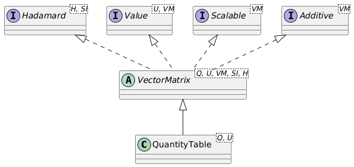

# Quantity Table

## Introduction

Quantity tables are 2-dimensional tables with quantity data of the same type. In a sense, it acts like a `MatrixNxM` without the ability to carry out matrix and vector calculations. Hadamard (element-wise) operations on quantity tables are supported.

The `QuantityTable` supports dense storage in a `double[]` or `float[]` array, or sparse storage, where values are stored with an integer-based row-column index and a `double` or `float` value. Since the sparse storage involves quite some overhead, tables need to have a significant percentage of 0-values (40-50% or more) for using sparse storage to make sense. 

## Quantity Table operations

A `QuantityTable` implements the `Hadamard` interface for element-by-element operations. These include:

- `invertElements()`: Invert each element of the table (1/value), where the unit will also be inverted. The inversion of a the elements of a `Duration` quantity table will result in a quantity table of the same size (number of rows and columns), with a unit if `1/s`, corresponding to a `Frequency`. 
- `multiplyElements(QuantityTable other)`: Multiply all elements of this quantity table with those of another quantity table of the same size (but often representing another quantity).
- `divideElements(QuantityTable other)`: Divide all elements of this quantity table by those of another quantity table of the same size (but possibly representing another quantity).
- `multiplyElements(Quantity<?, ?> quantity)`: Multiply all elements of this quantity table with the provided quantity.
- `divideElements(Quantity<?, ?> quantity)`: Divide all elements of this quantity table by those the provided quantity.

The result of a Hadamard operation on, e.g. a `QuantityTable<Duration, Duration.Unit>` will typically be a `QuantityTable<SIQuantity, SIUnit>` since the inverse operation, multiplication or division will result in a QuantityTable with a unit that is unknown on beforehand and cannot be determined by the compiler. In the above example of `invertElements` for a `Duration` quantity table, the resulting quantity table can be transformed into a proper `QuantityTable<Frequency, Frequency.Unit>` matrix using the `as(Frequency.Unit.Hz)` method.

Furthermore, a quantity table is additive, which means that two tables of the same size and same quantity can be added to and subtracted from each other. Quantity tables also implement the `Scalable` interface, which exposes the `scaleBy(double factor)` and `divideBy(double factor)` methods, scaling the elements of the quantity table by `factor`, respectively `1.0 / factor`.

## Transforming the QuantityTable

`QuantityTable` objects do not implement matrix operations such as determinant, matrix multiplication, etc. If a `QuantityTable` at some point needs to be used for matrix operations, the `asVector` and `asMatrix` methods can transform the `QuantityTable` into a `Matrix` or column or row `Vector` of any of the types. For this, the `QuantityTable` implements the `asMatrix1x1()`, `asMatrix2x2()`, `asMatrix3x3()`, `asMatrixNxN()`, `asMatrixNxM()`, `asVector1()`, `asVector2Row()`, `asVector2Col()`, `asVector3Row()`, `asVector3Col()`, `asVectorNRow()`, and `asVectorNCol()` methods. After the transformation, the table is available for linear algebra operations.

Reversely, the `Matrix` or column or row `Vector` classes can all be turned _into_ a `QuantityTable` with the `asQuantityTable()` method. 

 