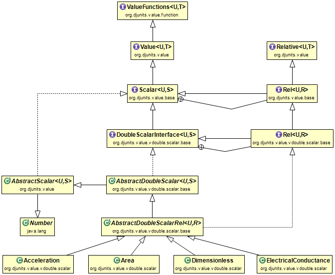
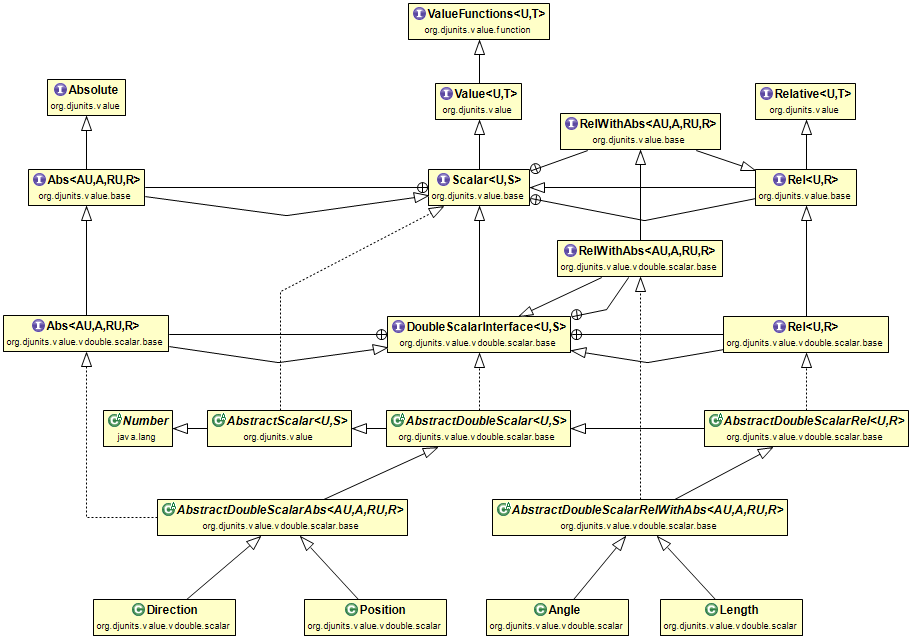

# Scalars

Scalar values are the foundation of DJUNITS. A scalar wraps a value (usually double precision floating point) and a unit. DJUNTIS contains class files for scalars of many unit types, but users can create scalars even for non-builtin unit types using the `SIScalar` class. Assume we have defined a JerkUnit with m/s<sup>3</sup> as the SI unit (see preceding page). We can then use it in a `Double` or `Float` `Scalar`, `Vector`, or `Matrix`:

```java
SIScalar jerkScalar = new SIScalar(2.0, SIUnit.of("m/s3"));
SIVector jerkVector = new SIVector(new DoubleVectorDataDense(new double[] {1.0, 2.0, 3.0}), SIUnit.of("ms-3"));
SIScalar jerk2 = jerkVector.get(1);
```

But it would be much nicer if we can define a `Scalar` called `Jerk` and a `Vector` called `JerkVector` that would allow us to code this as follows:

```java
Jerk jerk1 = new Jerk(1.2, JerkUnit.SI);
Jerk jerk2 = jerk1.times(2.0);
Jerk jerk3 = new Jerk(4.0, JerkUnit.IN_PER_S3);
double[] sv = new double[] {1, 2, 3, 4, 5}; 
JerkVector jerkVector = 
        new JerkVector(sv, JerkUnit.SI, StorageType.DENSE);
```

To create a jerk scalar that can be constructed from a value in, e.g. ft/s<sup>3</sup>, a JerkScalar class needs to be written.

## Building a new Scalar class


The next paragraphs show how to build a new Relative Scalar type. Building a new Scalar type that has an absolute and a relative subtype is unlikely to ever be required; we believe there are not other units that can be absolute, par the four that are already implemented in DJUNITS.

### Extending a Relative ScalarType from the Abstract Scalar Template

Several Abstract classes are available that simplify creating new `Scalar`, `Vector`, and `Matrix` classes. For the `Scalar` class, these are `DoubleScalarAbs` and `DoubleScalarRel`. The `DoubleScalarRel` class takes two generic arguments: the unit, and the name of the class itself. The 2nd parameter might seem strange, as the definition looks to be self-referential. The way it is used is that in the methods of the Abstract class, the generics argument is needed to specify the return type and argument type for various methods that are implemented in the abstract super class. So the first line of the new Jerk scalar class is:

```java
public class Jerk extends DoubleScalarRel<JerkUnit, Jerk>
```

Java abstract classes cannot prescribe anything about constructors in the extending classes. Each scalar class file in DJUNITS should have two constructors, one that takes a double argument, and one that takes an instance of the scalar type that the class file defines; i.c. another Jerk scalar:

```java
public Jerk(final double value, final JerkUnit unit)
{
    super(value, unit);
}

public Jerk(final Jerk value)
{
    super(value);
}
```

Another method that can be implemented is the `ofSI()` method as a quick generator with the default unit.

```java
public static Jerk of(final double valueSI)
{
    return new Jerk(valueSI, jerkUnit.SI);
}
```

With this minimum amount of code (two constructors, and the instantiateRel method), the Jerk scalar is ready for use in code like:

```java
Jerk jerk1 = new Jerk(1.2, JerkUnit.SI);
Jerk jerk2 = jerk1.times(2.0);
Jerk jerk3 = new Jerk(4.0, JerkUnit.IN_PER_S3);
Jerk jerk4 = Jerk.ofSI(5.0);
```

### Extra methods to implement

Often, extra methods are implemented for common multiplications and divisions involving the just defined type and other types. E.g., when we multiply the `Jerk` by a (Relative) `Duration`, we get an `Acceleration`. If we divide it by an `Acceleration`, we get a `Frequency` (m/s<sup>3</sup> / m/s<sup>2</sup> = 1/s). Such additional methods can be defined as follows:

```java
public final Acceleration multiplyBy(final Duration v)
{
    return Acceleration.ofSI(this.si * v.si);
}

public final Frequency divideBy(final Acceleration v)
{
    return Frequency.ofSI(this.si / v.si);
}
```

Due to the fact that all values are internally stored in standard (if possible SI) units, no scale factors are needed. This reduces the chances for errors considerably and is the main reason for using the SI system in science and engineering as much as possible. With these additional methods defined, the java compiler will know the result type of the common multiplications and divitions and catch programmer errors at compile time.

Another method that is often implemented is a static interpolate method, to interpolate between two `Jerk` scalars with a certain ratio (if the ratio is less than zero, or greater than one, this method performs linear extrapolation):

```java
public static Jerk interpolate(final Jerk zero, 
    final Jerk one, final double ratio)
{
    return new Jerk(zero.getInUnit() * (1 - ratio) 
            + one.getInUnit(zero.getUnit()) * ratio, zero.getUnit());
}
```

The above interpolate method ensures that the result uses the unit of the first argument. When the first argument has been defined in \[ft/s3\], the result will also use that unit (when printed). The unit for the result is obtained with the code zero.getUnit() and that unit gets recorded in the result. When the result is printed it will be expressed in \[ft/s3\]. When the result is used as the first argument of another call to the interpolate method it will propagate to the result of that call. Note that although the math is _not_ done in SI units, regardless of the particular Jerk units of the arguments, the internally stored value is always in the standard (SI) unit, i.c., \[m/s3\].

## Building a unit with absolute and relative subclasses

Most units are always relative, and don't have an absolute version. Only four units have an absolute version. See the `Length` and `Position` classes, or the `Temperature` and `AbsoluteTemperature` classes for examples how absolute and relative units are linked to each other. If you find another unit that can be Absolute and we apparently missed it; please contact us.

  
## Scalar classes, relative class implementation

The top half of this diagram contains only interfaces. Below that come abstract classes and along the bottom a small selection of the scalar classes of DJUNITS is shown.
 



## Scalar classes, absolute class implementation

The top half of this diagram contains only interfaces. Below that come abstract classes and along the bottom the scalar classes for Direction, Position, Angle and Length of DJUNITS are shown.


 