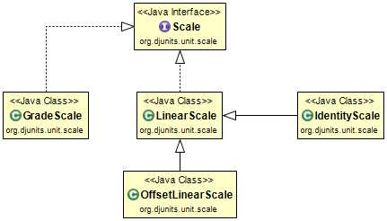

# Scales

Scales take care of converting values seen by the user to and from the internal SI values.

* A LinearScale is used for most units. A linear scale is a scale that is both additive and multiplicative. I.e. `toStandardUnit(a * b + c) == a * toStandardUnit(b) + toStandardUnit(c)`.
* The IdentityScale is a special case of a LinearScale where `toStandardUnit(a) == a`.
* The OffsetLinearScale is primarily used for conversion among units which have different zero reference points (e.g., absolute temperatures).
* The GradeScale is used to express grades and angles in percentages.



The Scale interface prescribes that a scale shall implement these three methods:
* `double toStandardUnit(double value)` which takes a value in the user's unit and returns the corresponding base (usually SI) value.
* `double fromStandardUnit(double value)` which takes a value in the base (usually SI) unit and returns the corresponding value in the user's unit.
* `boolean isBaseSIScale()` which should return true for scales that need no conversion to the base value, e.g., the `IdentityScale`.

Optional methods to implement are:
* `String toString()`
* `hashCode()`
* `equals(Object object)`

### Example OffsetLinearScale

The scale for conversion from Fahrenheit to Kelvin is an `OffsetLinearScale` with scaleFactor 5.0 / 9.0 and offset 459.67. The code for the toStandardUnit method is effectively:

```java
@Override
public final double toStandardUnit(final double value)
{
    return (value + 459.67) * (5.0 / 9.0);
}
```

The code for the fromStandardUnit method is effectively:

```java
@Override
public final double fromStandardUnit(final double value)
{
    return (value / (5.0 / 9.0)) - 459.67;
}
```

And the implementation for isBaseSIScale always returns false because this scale does not not even map 0.0 degrees F to 0.0&nbsp;K (the reverse - mapping 0.0 to 0.0 - is _not_ sufficient to qualify as a BaseSIScale).

In DJUNITS, the Fahrenheit scale is constructed together with the Fahrenheit absolute temperature unit using the deriveLinearOffset method of the Unit class using this code:

```java
public static final AbsoluteTemperatureUnit DEGREE_FAHRENHEIT =
        KELVIN.deriveLinearOffset(5.0 / 9.0, 459.67,
                TemperatureUnit.DEGREE_FAHRENHEIT,
                "dgF", "degree Fahrenheit",
                UnitSystem.SI_DERIVED,
                "\u00B0F", "degF", new String[] {"F"});
```

The first two arguments specify the scaleFactor and the offset. `TemperatureUnit.DEGREE_FAHRENHEIT` is the corresponding relative unit. (DJUNITS needs this in order to construct the result of a subtraction of two absolute temperatures where the first uses the AbsoluteTemperatureUnit.DEGREE_FAHRENHEIT.) The other arguments specify the abbreviations and full name as well as the unit system.

There is a similar (slightly simpler) costruction for the `DEGREE_CELCIUS` unit. DJUNITS can now convert absolute temperatures from Fahrenheit to Celcius via Kelvin (and back) without any additional code.
