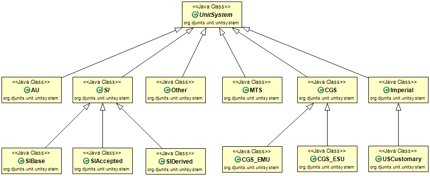

# Unit Systems

A unit system groups related units together, giving the group a name and an abbreviation, allowing for internationalization. The SI unit system subdivides into SI-base, SI-accepted and SI-derived. Similarly, the CGS unit system contains the CGS-EMU system and the CGS ESU system.

The SI-base units are the seven units from which all other SI units can be derived [https://en.wikipedia.org/wiki/SI_base_unit](https://en.wikipedia.org/wiki/SI_base_unit). The exact definitions of these units are occasionally updated when more precise and consistent ways to measure them are agreed upon. Generally, each newer definition results in a new value that matches the older one as precisely as was technically achievable at the date of the change.

All SI-derived units are defined in terms of one or more SI base units. E.g. the unit for electrical charge (Coulomb) is defined in terms of the SI-base unit for electrical current (Ampere) and the SI-base unit for time (second). An electical current of 1 Ampere transfers one Coulomb of electrical charge every second. Mathematically: `1 C = 1 A * 1 s`. Any change in the definition of one of the underlying base units (i.c. Ampere or second) affects the value of such a derived unit to ensure that the equation is true in every version of the SI system.

The SI-accepted units are conveniance units that are commonly used. E.g. minute, hour and day for time, liter for volume, electronvolt for energy, degree, (arc&#8209;)minute and (arc&#8209;)second for angles.

The CGS-EMU system extends the CGS (Centimeter-Gram-Second) system with units for electromagnetic quantities. The CGS-ESU system extends the CGS system with units for electrostatic quantities. See [Centimetre–gram–second system of units](https://en.wikipedia.org/wiki/Centimetre%E2%80%93gram%E2%80%93second_system_of_units).

