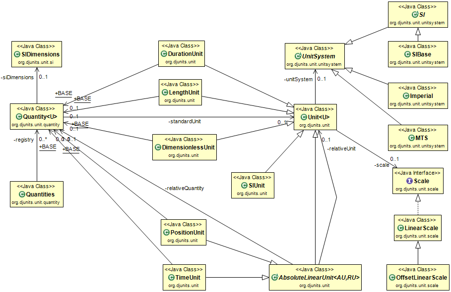

# Units

DJUNITS defines a sizable number of instantiated units that are ready to use, but this set can never be complete. Therefore, additional units can easily be instantiated and added.

## Adding a unit instance to an existing unit

Suppose, that a user would like to add the [Furlong](https://en.wikipedia.org/wiki/Furlong) (an old imperial length unit that is one eighth of a mile, or 660 feet), the [Fortnight](https://en.wikipedia.org/wiki/Fortnight) (a duration unit of 14 days), and a speed unit that indicates speed in Furlongs per Fortnight. All three should be relative units. Suppose that the user wants to make these three units available as public static constants in a utility class. The code to do so looks as follows:

```java
public static final LengthUnit FURLONG = LengthUnit.FOOT.deriveLinear(660.0, "fr", "Furlong");
public static final DurationUnit FORTNIGHT = DurationUnit.DAY.deriveLinear(14.0, "fn", "Fortnight");
public static final SpeedUnit FURLONGS_PER_FORTNIGHT =
        SpeedUnit.SI.deriveLinear(
                FURLONG.getScale().toStandardUnit(1.0) / FORTNIGHT.getScale().toStandardUnit(1.0),
                "fr/fn", "Furlongs per Fortnight");
```

The first two definitions use a constructor that define a unit in terms of an already existing unit using a factor. It is no problem that the Furlong is defined with respect to a Foot (instead of the SI unit for length; the meter). The (combined) factor to the SI unit will be calculated once (at the time of construction of the FURLONG unit) by the deriveLinear method of the FOOT unit. The FURLONGS_PER_FORTNIGHT speed unit is constructed using the deriveLinear method of SpeedUnit.SI. In this case the factor is computed from the scales of the just created length and duration units. Again, the factor to map Furlongs per Fortnight to and from the SI unit meters per second, will be automatically calculated once. These units can now be used in any piece of code, e.g.:

```java
Length oneThousandFurlong = new Length(1000.0, FURLONG);
System.out.println(oneThousandFurlong);
Duration twoFortNight = new Duration(2.0, FORTNIGHT);
System.out.println(twoFortNight);
Speed speed = oneThousandFurlong.divide(twoFortNight);
System.out.println(speed); // Uses SpeedUnit.SI; m/s
System.out.println(speed.toString(FURLONGS_PER_FORTNIGHT));
```

The program will print the following output:

```
1000.00000 fr
2.00000000 fn
0.08315476 m/s
500.000000 fr/fn
```


## Defining a completely new Unit

Of course it is also possible to define a completely new unit from scratch. The instructions below show how to create a new unit: the [Jerk](https://en.wikipedia.org/wiki/Jerk_(physics)). Jerk expresses change in acceleration per time unit.

Every unit extends `Unit` with the defined unit as its generic; this ensures that the generic unit class will do proper housekeeping, including for user-defined units. Many units have a natural zero value and linear scales to convert from and to various non-SI units. These units extend the abstract `Unit` class that provides a number of constructors with an easy-to-use factor to create a linear scale with respect to the standard (SI) unit. Jerk should be a relative unit. The header of the user-defined unit for jerk, the rate of change of acceleration (meter per second<sup>3</sup>) is therefore:

```java
public class JerkUnit extends Unit<JerkUnit>
```

Usually, the unit(s) on which a unit is based are stored as part of the unit. In this case, a length unit and a duration unit. Furthermore, several standard units are defined, among which the SI constant, if possible:

```java
/** The base quantity, with "m/s3" as the SI signature. */
public static final Quantity<JerkUnit> BASE = new Quantity<>("Jerk", "m/s3");

/** The SI unit for jerk is m/s^3. */
public static final JerkUnit SI =
        new JerkUnit().build(new Unit.Builder<JerkUnit>()
                 .setQuantity(BASE)
                 .setId("m/s3")
                 .setName("meter per second cubed")
                 .setUnitSystem(UnitSystem.SI_DERIVED)
                 .setSiPrefixes(SIPrefixes.NONE, 1.0)
                 .setScale(IdentityScale.SCALE));

/** Define some additional units for jerk. */
public static final JerkUnit M_PER_S3 = SI;
public static final JerkUnit CM_PER_S3 = 
        SI.deriveLinear(factorLD("cm", "s"), "cm/s3", "centimeter per second cubed");
public static final JerkUnit MM_PER_S3 = 
        SI.deriveLinear(factorLD("mm", "s"), "mm/s3", "millimeter per second cubed");
public static final JerkUnit FT_PER_S3 = 
        SI.deriveLinear(factorLD("ft", "s"), "ft/s3", "foot per second cubed");
public static final JerkUnit IN_PER_S3 = 
        SI.deriveLinear(factorLD("in", "s"), "in/s3", "inch per second cubed");
```

Many of the static constructors of the standard units derive the unit in a linear way from the SI unit using the `deriveLinear(...)` method. The linear conversion factor that has to be used is calculated by the `private static double FactorLD(length, duration)` method that is shown below:

```java
private static double factorLD(final String length, final String duration)
{
    double l = LengthUnit.BASE.of(length).getScale().toStandardUnit(1.0);
    double d = DurationUnit.BASE.of(duration).getScale().toStandardUnit(1.0);
    return l / (d * d * d);
}
```

No constructors are needed, nor anything else to start using the JerkUnit defined above. The arguments of `factorLD` are Strings. The `LD` part of the name hints that the first argument should be a Length and the second a Duration. Accidentally swapping the arguments would be a mistake that cannot be caught at compile time, but would be caught at runtime when the class is initialized and the code `LengthUnit.BASE.of(length)` fails to find a length unit named `s`.

Although the JerkUnit can now be used, life for the programmer becomes much easier when classes for JerkScalar, JerkVector and JerkMatrix are created. This is explained in the next pages.

<!-- TODO: THIS LINK NO LONGER WORKS <sup>Note: the amount of one Jerk is a foot per cubed second, and comes from several sources, e.g., [https://www.unc.edu/~rowlett/units/dictJ.html](https://www.unc.edu/~rowlett/units/dictJ.html).<br>-->
Note: the above code is for instructional purposes and does not include documentation and JavaDoc. Never write code without it! </sup>


## Classes for Quantity and Unit

The second column in this diagram shows a (very incomplete) sample of the unit classes implemented in DJUNITS.


