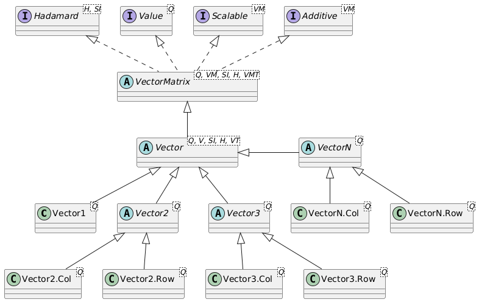

# Vector of quantities

## Introduction

Vectors and Matrices are one-dimensional and two-dimensional mathematical data containers for `Quantity` values, where each instance of a `Vector` or `Matrix` contains values of one specific quantity. A `Vector` or `Matrix` has a `displayUnit` for the entire vector or matrix. Internally, vectors and matrices store all values in their SI or BASE unit, just like the `Quantity`. 

Vectors and Matrices are implemented in four different ways: Sparse or Dense data storage, combined with Double or Float precision, which gives four combinations. Sparse storage should be used for vectors or matrices that contain many zero values. Dense data storage would, in that case, store all the zeros, whereas in a sparse storage only the numbers unequal to zero are stored, together with an index. As the index adds some overhead, sparse storage makes only sense when the number of zeros is over 50% of the number of entries. 


## Vector types

Vectors can be defined as row vectors or as column vectors. The difference is especially important for vector-vector multiplications and matrix-vector multiplications. `Row` and `Col` are defined as inner classes of the corresponding vectors. Several implementations of vectors exist, which are shown in the UML class diagram below:



As can be seen, the abstract class `Vector` extends the abstract class `Matrix`, where a row vector is a matrix with dimensions 1 x N, and a column vector is a matrix with dimensions N x 1. 

The generic type of `Vector` of any size is the `VectorN` class. This vector can use sparse or dense storage, and be populated with single-precision `float` values or double precision `double` values. For efficiency reasons, since the `VectorN` carries quite some overhead for the flexible data storage, separate classes are defined for `Vector1` (no distinction between row and column version), `Vector2` and `Vector3`, both with a `Row` and `Col` extension. 


## Vector operations

A `Vector` implements the `Hadamard` interface for element-wise operations. These include:

- `invertElements()`: Invert the vector on an element-by-element basis (1/value), where the unit will also be inverted. The inversion of a `Duration` vector will result in a vector of the same type (row/column) and size, with a unit of `1/s`, corresponding to a `Frequency`. 
- `multiplyElements(Vector other)`: Multiply the elements of this vector on an element-by-element basis with those of another vector of the same type and size (but generally representing another quantity).
- `divideElements(Vector other)`: Divide the elements of this vector on an element-by-element basis by those of another vector of the same type and size (but generally representing another quantity).
- `multiplyElements(Quantity<?, ?> quantity)`: Multiply the elements of this vector on an element-by-element basis with the provided quantity.
- `divideElements(Quantity<?, ?> quantity)`: Divide the elements of this vector on an element-by-element basis by those the provided quantity.

All Hadamard operations result in a new instance of the `Vector` with a new unit, but of the same type and with the same size.

The result of a Hadamard operation on, e.g. a `VectorN.Row<Speed, Speed.Unit>` will typically be a `VectorN.Row<SIQuantity, SIUnit>` since the inverse operation, multiplication or division will result in a Vector with a unit that is unknown beforehand and cannot be determined by the compiler. In the above example of `invertElements` for a `Duration` vector, the resulting vector can be transformed into a proper `VectorN.Row<Frequency, Frequency.Unit>` vector using the `as(Frequency.Unit.Hz)` method. 

If a `VectorN` is internally of a size congruent with a specific vector type, e.g. `Vector2.Row` or `Vector3.Col`, it can be obtained as such using methods such as `asVector2Row()` or `asVector3Col()`. Many such methods exist to carry out a transformation between vectors and matrices of various sizes. These methods will check the consistency of the vector size with the desired vector type at runtime. All vectors, irrespective of their size, can be transformed to a `QuantityTable` using the `asQuantityTable()` method, and to a `MatrixNxM` with the `asMatrixNxM()` method.

If vector-vector multiplication results in a special matrix type, for example multiplying a `Vector3.Col` by a `Vector3.Row` resulting in a 3x3 matrix, the resulting `MatrixNxM` from the calculation can be obtained as a `Matrix3x3` using the method `asMatrix3x3()`. This allows it, for example, to be added to another `Matrix3x3`. 

The `Vector` class implements the `transpose()` operation, which transforms a row vector into a column vector and vice versa. The resulting vector will have the same outer class type as the original; the `transpose()` method on a `Vector2.Row` will result in a `Vector2.Col`. 

Furthermore, a vector is `Additive`, which means that vectors of the same type, size, and quantity can be added to and subtracted from each other. It is also possible to `add` or `subtract` a fixed `Quantity` of the correct type to/from the vector. Vectors also implement the `Scalable` interface, which exposes the `scaleBy(double factor)` and `divideBy(double factor)` methods. Since vectors are immutable, all these operations result in a new instance of a vector.


## Obtaining values of vector entries

Several methods exist to get access to the entries of a `Vector`. When single entries are retrieved, two versions of the methods exist: a version where the index is 0-based, and a version where the index is 1-based. The 1-based methods have a name that starts with `m` for `matrix`, since the entries of a vector start with v<sub>1</sub> and not v<sub>0</sub> and the entries of a matrix start with m<sub>11</sub>, and not with m<sub>00</sub>. So, there is an `si(index)` method where `index` ranges from `0` to `vector.size()-1`, and an `msi(mIndex)` method where `mIndex` ranges from `1` to `vector.size()`. 

A `Vector` contains the following methods to obtain its values:

- `double[] si()` returns the values of the vector in SI-units as a `double[]` array with the same length as the vector.
- `Q[] getScalarArray()` returns a 1-dimensional strongly typed quantity array that represents the vector. The quantities in the array will all have the same `displayUnit` as the original `Vector`.
- `double si(int index)` returns the SI-value of the entry at the 0-based `index`. 
- `double msi(int mIndex)` returns the SI-value of the entry at the 1-based `mIndex`. 
- `Q get(int index)` returns the quantity representation of the entry at the 0-based `index`. The returned `Quantity` will have the same `displayUnit` as the original `Vector`.
- `Q mget(int mIndex)` returns the quantity representation of the entry at the 1-based `mIndex`. The returned `Quantity` will have the same `displayUnit` as the original `Vector`.

All `Matrix` methods are also implemented for the `Vector`, where a `Vector` is seen as a 1xM or Nx1 matrix. These methods are not often used, however. If necessary, one can use these methods such as `get(int row, int col)`, `si(int row, int col`), and several more methods for retrieving row and column quantities and SI-values, both with 0-based and 1-based row and column indexes. 


## Mathematical operations

A `Vector` implements several mathematical operations. The most important ones are:

- `int rows()` returns the number of rows of the vector.
- `int cols()` returns the number of columns of the vector.
- `int size()` returns the size of the vector; the number of rows for a column vector, or the number of columns for a row vector.
- `boolean isColumnVector()` returns whether this vector is a column vector.
- `Iterator<Q> iterator()` returns a `Quantity` iterator over the entries of the vector.
- `Q mean()` returns the mean quantity value of the entries of the `Vector` as a strongly typed `Quantity`.
- `Q min()` returns the minimum quantity value of the entries of the `Vector` as a strongly typed `Quantity`.
- `Q max()` returns the maximum quantity value of the entries of the `Vector` as a strongly typed `Quantity`.
- `Q mode()` returns the mode quantity value of the entries of the `Vector` as a strongly typed `Quantity`. For a vector, this returns the maximum quantity value of the entries.
- `Q median()` returns the median quantity value of the entries of the `Vector` as a strongly typed `Quantity`. The median value is the value  of the middle element when all entries have been sorted on their SI-values. When the size of the vector is even, the average of the two values that together make up the middle is returned. 
- `Q sum()` returns the sum of the entries of the `Vector` as a strongly typed `Quantity`.
- `V negate()` returns a `Vector` of the same type and size where all entries x<sub>i</sub> have been set to &minus;x<sub>i</sub>. 
- `V abs()` returns a `Vector` of the same type and size where all entries x<sub>i</sub> have been set to |x<sub>i</sub>|. 
- `Q normL1()` returns the L1-norm of the vector's entries, expressed as a quantity. <br>The L1-norm is |x<sub>1</sub>| + |x<sub>2</sub>| + ... + |x<sub>n</sub>|.
- `Q normL2()` returns the L2-norm of the vector's entries, expressed as a quantity. <br>The L2-norm is sqrt(x<sub>1</sub><sup>2</sup> + x<sub>2</sub><sup>2</sup> + ... + x<sub>n</sub><sup>2</sup>).
- `Q normLp(int p)` returns the L<sub>p</sub>-norm of the vector's entries, expressed as a quantity. <br>The L<sub>p</sub>-norm is (x<sub>1</sub><sup>p</sup> + x<sub>2</sub><sup>p</sup> + ... + x<sub>n</sub><sup>p</sup>)<sup>(1/p)</sup>.
- `Q normLinf()` returns the L<sub>&infin;</sub>-norm of this element, expressed as a quantity. <br>The L<sub>&infin;</sub>-norm is max(|x<sub>1</sub>|, |x<sub>2</sub>|, ..., |x<sub>n</sub>|).
- `Q norm()` returns the default norm for the vector's entries. The default is defined as the L2-norm.
- `double nonZeroCount()` and `double nnz()` both return the number of non-zero entries in the vector.


## Example vector definition and storage

The example below shows the instantiation and usage of a column vector with 5 elements `VectorN.Col`:

```java
VectorN.Col<Length, Length.Unit> lv1 = VectorN.Col.of(
    new double[] {10, 20.0, 60, 120.0, 400.0}, Length.Unit.km);
Duration duration = Duration.of(2.0, "h");
VectorN.Col<Speed, Speed.Unit> sv1 = 
    lv1.divideElements(duration).as(Speed.Unit.km_h);
System.out.println("Length: " + lv1);
System.out.println("Speed : " + sv1);
```

Executing the code results in:

```
Length: Col[10.0, 20.0, 60.0, 120.0, 400.0] km
Speed : Col[5.0, 10.0, 30.0, 60.0, 200.0] km/h
```

The output shows that the vectors are column vectors, although they are printed row-wise. 
