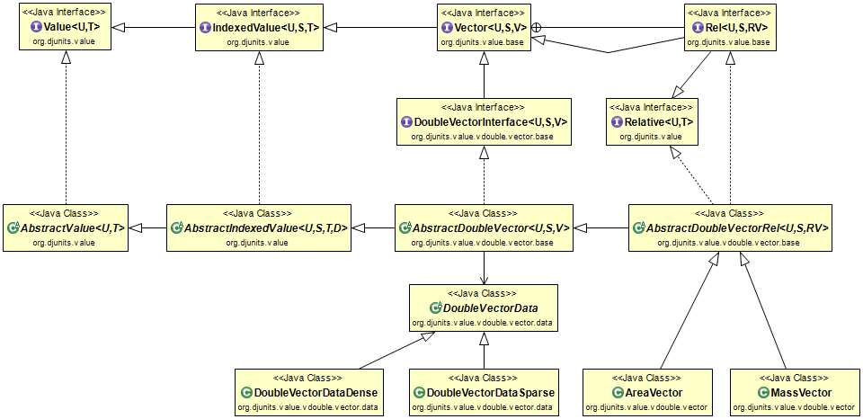
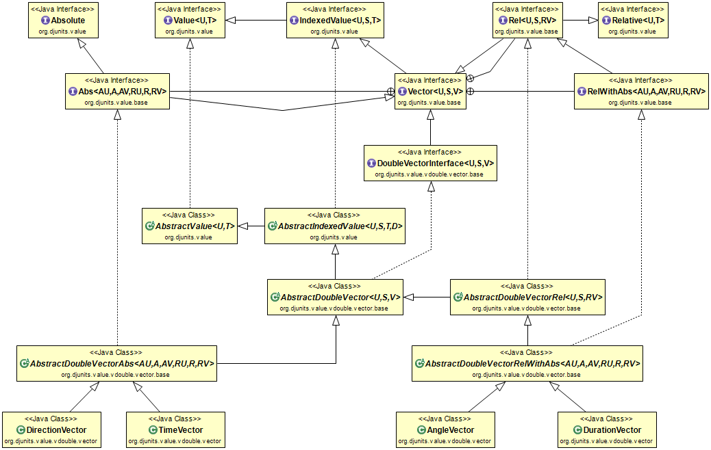

# Vectors

## Introduction

Vectors and Matrices are implemented in eight different ways: Sparse or Dense data storage, Mutable or Immutable, and Double or Float precision, which gives eight combinations. Sparse storage should be used for vectors or matrices that contain many zero values. Dense data storage would, in that case, store all the zeroes, whereas in a sparse storage only the numbers unequal to zero are stored, together with an index. As the index adds some overhead, sparse storage makes only sense when the number of zeroes is over 50% of the number of cells. A second differentiation is Mutable versus Immutable. Normally, vectors and matrixes are immutable, just like the scalars. When, however, calculations on large matrices or vectors take place, results of those calculations always have to be stored in a new vector or matrix. When the vector or matrix is mutable, however, the result can be stored in the vector or matrix itself. Suppose that we want to round the data in a 1000x1000 matrix to the nearest integer value. With a mutable data type, this works as follows (this example uses a vector of 10 values; not a 1000x1000 matrix):

```java
double[] data = new double[10];
for (int i = 0; i < data.length; i++)
    data[i] = i * 0.8;
LengthVector lengthVector = DoubleVector.instantiate(data, 
    LengthUnit.FOOT, StorageType.DENSE);
lengthVector = lengthVector.mutable();
System.out.println(lengthVector);
lengthVector.rint();
System.out.println(lengthVector);
```

Mutable vectors and matrices can be turned into immutable ones and vice versa.

Note 1: One of the advantages is that operations on vectors and matrices take place in parallel when the vector or matrix is sufficiently large.

Note 2: In the example code above, the rounding operation would change the values to the nearest multiple of a meter; which is probably not the intended effect. The output of the example program is:

```
[ 0.00000000 0.80000000 1.60000000 2.40000000 3.20000000 4.00000000 4.80000000 5.60000000 6.40000000 7.20000000] ft
[ 0.00000000 0.00000000 0.00000000 3.28083990 3.28083990 3.28083990 3.28083990 6.56167979 6.56167979 6.56167979] ft
```

Rounding to the nearest integer foot (the display unit) can be done, but requires the user to write a DJUNITS `DoubleFunction` and use the assign method of the `LengthVector` like this:

```java
final Scale scale = lengthVector.getDisplayUnit().getScale();
lengthVector.assign(new DoubleFunction()
{
    @Override
    public double apply(final double value)
    {
        return scale.toStandardUnit(Math.rint(scale.fromStandardUnit(value)));
    }
});
System.out.println(lengthVector);
```

This rounds all values to integer feet (using multiple execution threads) and prints:

```
[ 0.00000000 1.00000000 2.00000000 2.00000000 3.00000000 4.00000000 5.00000000 6.00000000 6.00000000 7.00000000] ft
```


## Building a new vector class

As an example we will build the `JerkVector` class. 

### Extending the Abstract Vector Template
The `Jerk` (defined in the preceding pages) is a relative unit, therefore the `JerkVector` class must extend the `AbstractDoubleVectorRel` class. The AbstractDoubleVectorRel class takes three generic arguments; the unit, scalar, and the name of the new vector class itself. The 3rd parameter might seem strange, as the definition looks to be self-referential (unless you just read the page on constructing the Jerk scalar). The way it is used is that in the methods of the Abstract class, the generics argument is needed to specify the return type and argument type for various methods that are implemented in the abstract super class. So the first line of the new JerkVector class is:

```java
public class JerkVector extends AbstractDoubleVectorRel<JerkUnit, Jerk, JerkVector>
```

In this class one constructor must be present that takes two arguments: a `DoubleVectordata` object and a `JerkUnit`:

```java
public JerkVector(final DoubleVectorData data, final JerkUnit displayUnit)
{
    super(data, displayUnit);
}
```

Additionally, the JerkVector class must implement three methods. The first returns the Class of the corresponding scalar; i.c. Jerk.class:

```java
@Override
public Class<Jerk> getScalarClass()
{
    return Jerk.class;
}
```

The second method constructs a JerkVector from a `DoubleVectorData` object and a `JerkUnit`:

```java
@Override
public JerkVector instantiateVector(final DoubleVectorData dvd, 
    final JerkUnit displayUnit)
{
    return new JerkVector(dvd, displayUnit);
}
```

The final and third method creates a scalar Jerk from a double value in the SI base unit and a `JerkUnit`:

```java
@Override
public Jerk instantiateScalarSI(final double valueSI, final JerkUnit displayUnit)
{
    Jerk result = Jerk.instantiateSI(valueSI);
    result.setDisplayUnit(displayUnit);
    return result;
}
```

That's it. With this class JerkVectors can be created with code like:

```java
double[] sv = new double[] {1, 2, 3, 4, 5};
JerkVector jerkVector = DoubleVector.instantiate(sv, JerkUnit.SI, 
    StorageType.DENSE, JerkVector.class);
```

## Vector Classes, Relative only
The top of the diagram shows only interfaces. Below that are abstract classes and along the bottom the data storage classes (`DoubleVectorDataDense` and `DoubleVectorDataSparse`) and two of the many vector classes of DJUNITS.




## Vector Classes, Absolute plus Relative
The top of the diagram shows only interfaces. Below that are abstract classes and along the bottom the vector classes for Direction, Position, Angle and Length of DJUNITS are shown.


